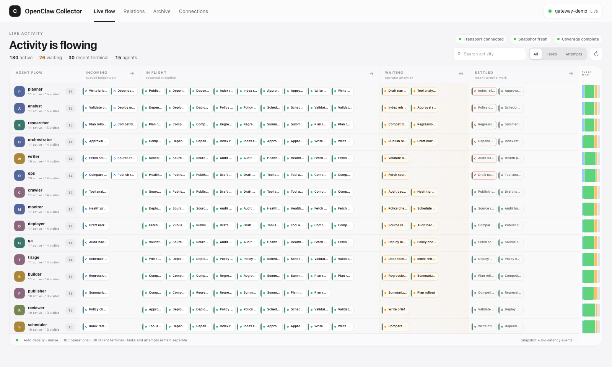

# OpenClaw Collector

A read-only live activity board for a single OpenClaw Gateway. It combines authoritative task and session snapshots with low-latency events, stores a bounded local SQLite projection, and connects with `operator.read` only.



## Quick start

Requirements: Node.js 22.16+, pnpm 10, and a running OpenClaw Gateway using token authentication.

```bash
git clone https://github.com/cogine-ai/ARKanban.git
cd ARKanban
pnpm install --frozen-lockfile
cp collector.config.example.json collector.config.json
export OPENCLAW_GATEWAY_TOKEN="your-gateway-token"
pnpm check
pnpm build
pnpm start
```

`pnpm check` must return `"ok": true`. If your Gateway does not use the default `ws://127.0.0.1:18789`, update `collector.config.json` first. The token must match the Gateway's `gateway.auth.token` or `OPENCLAW_GATEWAY_TOKEN`.

Open `http://127.0.0.1:47123`.

Collector listens on loopback. To view it from another computer, forward the port and then open the same URL locally:

```bash
ssh -N -L 47123:127.0.0.1:47123 user@gateway-host
```

## Development

```bash
pnpm dev
```

Open `http://127.0.0.1:5173`. The API runs on `http://127.0.0.1:47123`.

## Demo data (optional)

Use the bundled mock when you want to inspect dense layout and live event behavior without creating real OpenClaw work:

```bash
# terminal 1
pnpm mock:gateway

# terminal 2
pnpm demo
```

Open `http://127.0.0.1:47123`. This fixture produces 180 operational records, about 30 waiting attempts, 30 recent terminal records, five next-hour Cron forecasts, and live tool events. Mock data is never used by `check`, `start`, or `dev`.

## What you get

- Live Flow: adaptive-density Agent lanes across Incoming, In Flight, Waiting, and Settled
- Incoming forecast: queued Tasks first, followed by enabled Cron jobs due within the next hour; Cron remains a read-only, non-persisted forecast
- Activity Inspector: current state, observation evidence, identities, timeline, and relations
- Relations: exact parent links and correlation-only run links
- Archive: recent terminal task and attempt projections
- Connections: Gateway, Task snapshot, Session snapshot, and Event stream health
- HTTP API and SSE: `/api/v1/meta`, `/api/v1/snapshot`, `/api/v1/activities/:id`, `/api/v1/events`
- Operational probes: `/healthz` and `/readyz`

Task ledger records and observed execution attempts are intentionally separate. A generic attempt end remains `outcome: unknown`; Collector only shows success when an authoritative source establishes it.

## Design package

- [Complete v1 blueprint](docs/v1/openclaw-collector-v1-blueprint.md)
- [Interactive Adaptive Activity River prototype](docs/v1/openclaw-collector-v1-adaptive-flowboard-prototype.html)
- [Motion specimen](docs/v1/openclaw-collector-v1-adaptive-flowboard-motion.webm)
- Load specimens: [4 active](docs/v1/openclaw-collector-v1-adaptive-flowboard-sparse-final.png), [180 active](docs/v1/openclaw-collector-v1-adaptive-flowboard-dense-final.png), [600 active](docs/v1/openclaw-collector-v1-adaptive-flowboard-extreme-final.png)

The v1 uses the public OpenClaw Gateway protocol with explicit `operator.read`. The raw protocol adapter is isolated in `src/gateway/adapter.ts` so it can be replaced by an official published Gateway client without changing the collector or UI layers.

Source analysis and code links in the blueprint are pinned to OpenClaw commit `ff73a14f5ae71a899e5db9a3a41718ab1d104517`.

## Status

The v1 MVP and deterministic integration tests are implemented. OpenClaw 2026.8.1 / protocol v4 compatibility has been verified against a real isolated Gateway. System-service and container packaging are not included yet.

## License

Licensed under the [Apache License 2.0](LICENSE). See [NOTICE](NOTICE) for attribution.
