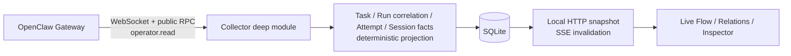
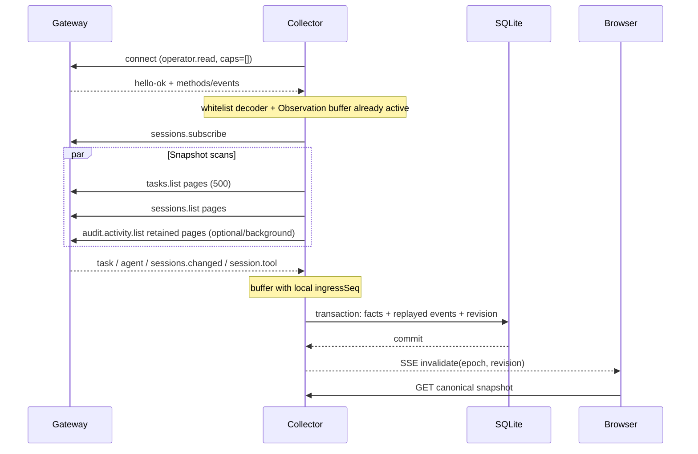
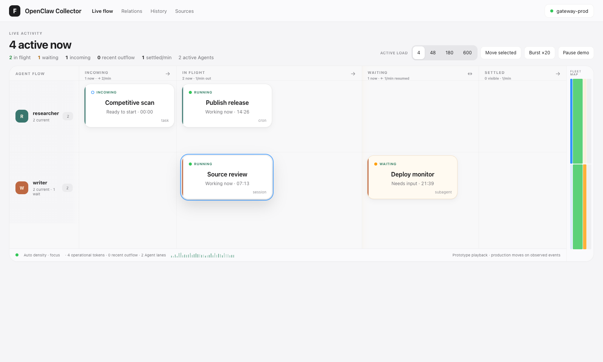
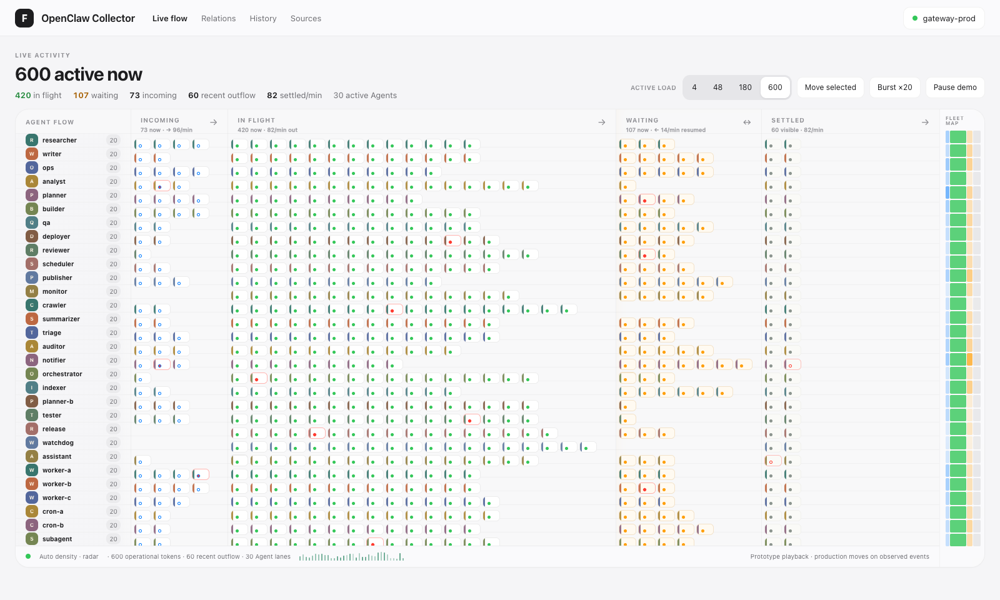
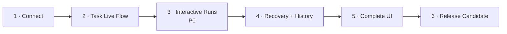

# OpenClaw Collector v1 完整蓝图

> 文档状态：**Architecture & Product Contract Frozen**
> 就绪判断：**READY WITH RISKS**
> 核验基线：OpenClaw `ff73a14f5ae71a899e5db9a3a41718ab1d104517`，仓库干净，2026-08-13
> 交付形态：独立项目、单 Gateway、只读、本地 Web UI、SQLite；不嵌入 OpenClaw，不修改 OpenClaw core

> 实施补充：2026-08-14 的 [自适应 Settled 规格](./ar-kanban-adaptive-board-implementation-spec.md) 与 2026-08-15 的 [Incoming Cron 规格](./ar-kanban-incoming-cron-implementation-spec.md) 是本冻结蓝图的后续实施修订；涉及范围、分组、单元格配额和未来 Cron 时，以后两份文档为准。

本蓝图一次性冻结 v1 的产品范围、领域抽象、架构、数据模型、协议、界面、交互、测试和完成门。后续“切片”只改变代码实现顺序，不再逐阶段补设计或改变公开契约。

---

## 0. 一页结论

### 0.1 v1 是什么

OpenClaw Collector v1 是一个运行在 Gateway 外部的只读观察器。它通过公开的 Gateway WebSocket/RPC，以显式 `operator.read` 身份采集 Task、Session、Agent Event 和可选 Audit 元数据，把 Task 与“公开证据能区分的 observed run attempt”统一投影为 Activity，并在本机提供实时看板、受约束画布和详情时间线。`runId` 只作为可复用 correlation，不冒充一次执行的唯一身份。



### 0.2 v1 的核心承诺

- 展示当前 Gateway 公共运行观察面中，Collector 凭据可见的全部 Task Ledger 记录。
- 对当前可见的普通会话 run 提供在线期间的实时高覆盖观察；生命周期按 observed attempt 隔离，以 Session 快照修复活跃线索，无法证明同一 attempt 时明确标 ambiguous。
- 断线、慢消费者、事件 gap、Gateway 重启后，最终回到 RPC 快照所表达的公共状态。
- 所有无法确认的状态显式显示为 `unknown`、`partial` 或 `stale`，绝不猜测成功。
- Gateway 凭据只存在于 Collector 后端；浏览器永远不直接连接 Gateway。
- Collector 不调用任何 OpenClaw 写方法，也不创建或修改 Task、TaskFlow、Workboard Card。

### 0.3 v1 不承诺什么

- 不承诺 exactly-once、线性一致或跨多个 Gateway registry 的原子快照。
- 不承诺还原 Collector 部署前或断线期间普通 run 的完整 tool/plan/approval 过程。
- 不读取完整 Managed TaskFlow 状态；只使用 Task Summary 已公开的 `flowId`、`parentTaskId`。
- 不观察 `controlUiVisible:false` 的普通公共流、插件私有数据库或未进入公共 Task/Session/Event/Audit 面的内部工作。注意 `audit.activity.list` 的全局 retained ledger 可能含由进程内 audit-only/synthetic 事件形成的 bounded metadata；公共 RPC 没有字段可把它们排除，因此 v1 会把其中 terminal `agent_run` 诚实标为 `Global audit metadata`，但不恢复 Session 关联或 active 状态。
- 不提供取消、重试、steer、审批或任何运行写控制。
- 不支持远程暴露、多用户、RBAC、多 Gateway、HA；v1 只绑定 loopback。

如果“完整 Managed TaskFlow 全局状态”或“全部进程内工作”成为 v1 必须项，本方案立即转为 **NOT READY**，需要先向 OpenClaw 增加新的公开、脱敏、`operator.read` read seam。

---

## 1. 产品定义

### 1.1 目标用户与场景

用户是同时运行多个 OpenClaw Agent 的技术 Operator，而不是维护项目卡片的项目经理。他可能刚启动一组普通会话 run、cron、subagent 或 ACP，打开 Collector 后要在几秒内回答：

1. 哪些 Agent 现在正在工作？
2. 每项工作处于 queued、active、waiting 还是 terminal？
3. 当前在 starting、planning、model、tool 还是 waiting approval？
4. 哪些工作失败、阻塞、失联或需要关注？
5. 哪些 Task、ObservedAttempt、Session、Flow 具有精确关系，哪些只有 run correlation？
6. 眼前状态来自权威快照、实时事件，还是不完整推断？

核心动词是：**扫描、定位、跟踪、核实、关联、下钻、聚焦**。

### 1.2 用户结果

在 Collector 已 ready、Gateway live、10k/2k 标准 fixture 已入库的前提下，从本地浏览器发起导航到首个含真实 Activity 的 Live Flow paint `< 5s`。用户无需切换 Agent 或 Session，就能识别当前运行、等待、需关注和最近完成的工作；两次交互内可打开任一 Activity 的身份、来源证据、时间线和精确关系。

### 1.3 成功标准

| 维度 | v1 目标 |
|---|---|
| 在线更新 | Gateway 事件到浏览器可见更新，p95 `< 2s` |
| 故障收敛 | 重连并成功取得所有必需快照后，`< 10s` 收敛 |
| 状态诚实性 | 无终态证据时绝不显示 `succeeded` |
| 去重 | 同一 Task 只有一个 Task Activity；每个公开证据可区分的 observed attempt 只有一个 Attempt Activity；同一 run correlation 可包含多次 attempt |
| 规模包络 | 10,000 Task、2,000 Session、50 event/s 下保持可用 |
| 安全 | 只申请 `operator.read`；前端、日志、SSE、DB 中无 Gateway secret |
| 可访问性 | Live Flow 可全键盘操作；状态不只依赖颜色；Relations 有等价 Outline Tree |

这些数字是实现验收门，不是外部营销 SLO；首次基准若证明不合理，只能通过一次明确的 contract amendment 调整，不能静默放宽。

---

## 2. 真实 OpenClaw 能力与覆盖合同

### 2.1 已核验的公共观察面

| 来源 | v1 用途 | 权威程度 | 已核验证据 |
|---|---|---|---|
| `tasks.list` | 全局分页读取 Task Ledger | Task lifecycle 权威 | 参数中的 `agentId`/`sessionKey` 均为可选过滤；无过滤时分页全局 registry：[tasks.ts](https://github.com/openclaw/openclaw/blob/ff73a14f5ae71a899e5db9a3a41718ab1d104517/src/gateway/server-methods/tasks.ts#L65) |
| `task` event | Task 低延迟 upsert/delete/restored | best-effort invalidation | 广播为 `operator.read`，慢消费者可丢：[server-runtime-subscriptions.ts](https://github.com/openclaw/openclaw/blob/ff73a14f5ae71a899e5db9a3a41718ab1d104517/src/gateway/server-runtime-subscriptions.ts#L382)；observer 明确为 incremental/best-effort：[task-registry.store.ts](https://github.com/openclaw/openclaw/blob/ff73a14f5ae71a899e5db9a3a41718ab1d104517/src/tasks/task-registry.store.ts#L35) |
| `sessions.list` | 当前 Session 与 active run 投影 | 普通 run 活跃态修复源 | 行中有 `hasActiveRun`，有可枚举 run 时才有 `activeRunIds`：[sessions-read.ts](https://github.com/openclaw/openclaw/blob/ff73a14f5ae71a899e5db9a3a41718ab1d104517/src/gateway/server-methods/sessions-read.ts#L396) |
| `sessions.subscribe` | 订阅 `sessions.changed` 与旁路 `session.tool` | 连接态订阅 | 连接加入 broad registry：[sessions-subscriptions.ts](https://github.com/openclaw/openclaw/blob/ff73a14f5ae71a899e5db9a3a41718ab1d104517/src/gateway/server-methods/sessions-subscriptions.ts#L19)；断线即结束：[protocol.md](https://github.com/openclaw/openclaw/blob/ff73a14f5ae71a899e5db9a3a41718ab1d104517/docs/gateway/protocol.md#L636) |
| raw `agent` event | lifecycle、plan、approval 等实时线索 | 低延迟、可丢 | 公共事件带 `runId/seq/sessionKey/agentId` 及 stream：[agent-events.ts](https://github.com/openclaw/openclaw/blob/ff73a14f5ae71a899e5db9a3a41718ab1d104517/src/infra/agent-events.ts#L40) |
| `session.tool` | 旁路 Collector 的 tool phase | 低延迟、可丢 | tool 不默认全局 fanout，而是镜像给 `sessions.subscribe` 连接：[server-chat.ts](https://github.com/openclaw/openclaw/blob/ff73a14f5ae71a899e5db9a3a41718ab1d104517/src/gateway/server-chat.ts#L1590) |
| `sessions.changed` | run start/end/error 及 session snapshot | 低延迟、可丢 | start 携带 `sessionKey/agentId/runId/ts`：[server-chat.ts](https://github.com/openclaw/openclaw/blob/ff73a14f5ae71a899e5db9a3a41718ab1d104517/src/gateway/server-chat.ts#L1750)；terminal 在持久化路径发出：[server-chat.ts](https://github.com/openclaw/openclaw/blob/ff73a14f5ae71a899e5db9a3a41718ab1d104517/src/gateway/server-chat.ts#L887) |
| `audit.activity.list` | 可选的 run/tool 元数据历史补强 | 稳定游标、best-effort | `operator.read`、30 天、最多 100k、metadata-only：[protocol.md](https://github.com/openclaw/openclaw/blob/ff73a14f5ae71a899e5db9a3a41718ab1d104517/docs/gateway/protocol.md#L756) |

公开 `TaskSummary` schema 含 `taskId/runId/agentId/sessionKey/flowId/parentTaskId/runtime/status/progress/lastTool` 等字段，也允许可选 prompt/result；当前 `tasks.list/task` mapper 默认只填 bounded summary，但 Collector 仍必须逐字段 allowlist，不能信任整个 object：[tasks.ts schema](https://github.com/openclaw/openclaw/blob/ff73a14f5ae71a899e5db9a3a41718ab1d104517/packages/gateway-protocol/src/schema/tasks.ts#L44)。v1 **不调用 `tasks.get`**，并在 list/event decoder 明确丢弃 prompt/result 与未知 key：[task-summary.ts](https://github.com/openclaw/openclaw/blob/ff73a14f5ae71a899e5db9a3a41718ab1d104517/src/gateway/server-methods/task-summary.ts#L48)。

### 2.2 覆盖矩阵

| 对象 | v1 覆盖 | 精确承诺 |
|---|---|---|
| Task Ledger 中的 cron/subagent/ACP/CLI | 是 | 当前全量 + Collector 留存期内观察到的终态历史；最终一致 |
| 普通会话触发的公开 run | 是，高覆盖 | 在线期间采集 raw `agent + session.tool + sessions.changed`；以 `sessions.list` 修复当前活跃态 |
| `hasActiveRun=true` 但无 runId | 是，降级 | 显示 `Unresolved active run`，不虚构 runId 或 outcome |
| Collector 部署前的普通 run | 部分 | Audit terminal `agent_run` 恢复为 `attempt(origin=audit)`；复用/并发 ref 无法唯一配对时保留多个 fragment/ambiguous group，started-only 不伪装为当前 active |
| Managed TaskFlow | 部分 | 只显示 task-linked `flowId`、父子任务和 Flow 分组；不显示完整 flow state/currentStep/wait metadata/revision |
| Workboard Card | 否 | Workboard 是规划对象，不是运行事实源；v1 不引入依赖 |
| 插件私有 DB/内存 | 否 | 除非插件未来主动提供公开 read RPC/event 并另做具体 adapter |
| hidden/internal Gateway work | 不保证 | 没有公开 Task、Session、Event 或 Audit 证据就不声称可见 |

Task Ledger 和 `audit.activity.list` 当前都是全局 `operator.read` 查询面，不套用 Session visibility；Session-derived run 与公共 Agent events 则遵守 Gateway 的 session-sharing 过滤。identified 非 admin 看不到 incognito，其他人的 draft 也不可见；identityless solo 连接有特殊 owner-equivalent 行为：[session-sharing.ts](https://github.com/openclaw/openclaw/blob/ff73a14f5ae71a899e5db9a3a41718ab1d104517/src/gateway/session-sharing.ts#L676)。Audit 回填可能因此恢复一个已不可从 `sessions.list` 看见的 run：它仍可作为 `audit_only` 历史 Activity 显示，但不得恢复 raw session metadata、current active state 或 Session deep link；UI 明确标 `Global audit metadata`。因此产品文案统一使用：

> “当前 Gateway 公共观察面与当前凭据可见的工作”，而不是“宿主机中物理存在的所有运行”。

### 2.3 TaskFlow 与 Workboard 的边界

- TaskFlow 是 Task 上层的 durable orchestration；Flow 协调 Task，不替代 Task：[taskflow.md](https://github.com/openclaw/openclaw/blob/ff73a14f5ae71a899e5db9a3a41718ab1d104517/docs/automation/taskflow.md#L159)。
- 当前没有公开的全局 TaskFlow Gateway RPC。v1 将 `flowId` 作为 grouping reference，而不是伪造 Flow 状态。
- Workboard 的可复用经验是“revision invalidation 后重读 canonical snapshot”：[workboard.md](https://github.com/openclaw/openclaw/blob/ff73a14f5ae71a899e5db9a3a41718ab1d104517/docs/plugins/workboard.md#L97)。v1 复用这个恢复思想，不复制 Workboard 的 Card authority，也不把运行自动写成 Card。

---

## 3. 阶段、状态与证据抽象

这是 v1 最重要的产品契约：**Lifecycle、Outcome、Phase、Attention、Flow Stage、Lane、Evidence 必须分离。**

### 3.1 七个正交维度

| 维度 | 值 | 回答的问题 |
|---|---|---|
| `state` | `queued / active / terminal / unknown` | 它在生命周期哪里？ |
| `outcome` | `none / succeeded / failed / cancelled / timed_out / blocked / lost / unknown` | 如果结束，结果是什么？ |
| `phase` | `none / starting / planning / model / tool / waiting_approval / unknown` | 它此刻在做什么？ |
| `attention` | `none / waiting / blocked / error / stale / partial` | Operator 是否需要关注，为什么？ |
| `stage` | `incoming / in_flight / waiting / settled / unresolved` | Live Flow 把它放在哪个空间锚点？ |
| `lane` | 默认 `agentId`；可切 `runtime / flow / session` | Live Flow/Relations 按什么维度分流带？ |
| `evidence` | 每来源的 `live / snapshot / gap / unavailable` | 当前判断为何可信？ |

`stage` 只是 UI 投影，不写回 canonical facts。默认映射按以下顺序执行，保证一项 Activity 只出现在一个 flow anchor：

1. `state=terminal` → `settled`，包括 failed/blocked/timed_out/cancelled；失败 outcome 用标记和过滤器表达，不在当前 Attention 中永久堆积。
2. `state=active` 且 `phase=waiting_approval` 或 `attention=waiting` → `waiting`。
3. `state=queued` → `incoming`。
4. `state=active` → `in_flight`。
5. `state=unknown` 但存在可信 last-known stage → 保留该 stage，同时 `lifecycleConfidence=unresolved`、`attention=partial|stale`。
6. 其余 unknown/conflict → `unresolved` side shelf；它不冒充生命周期 stage，也不计入 incoming/in_flight/waiting/settled 任一列。

Attention 是 Activity 上的**叠加语义**，不是一条必经 lifecycle stage；它通过 notch、形状、文字和过滤器表达。最近失败属于 Settled，可用 `outcome=failed` 快速过滤并在 Archive 中保留。

### 3.1.1 Freshness、Partial 与 Attention 的确定规则

| 条件 | 字段变化 | 是否标记 Attention |
|---|---|---|
| WebSocket 断开 | 全局 sync=`offline`；event evidence=`stale` | 不立即搬动所有 Card |
| Task authoritative snapshot 超过 150s 未成功 | 非 terminal Task `freshness=stale, attention=stale` | 是 |
| Session authoritative snapshot 超过 90s 未成功 | 非 terminal session-segment Attempt `freshness=stale, attention=stale` | 是 |
| 当前 required source unavailable/error | `attention=partial`，受影响字段降 unknown | 是，且只影响依赖该 source 的非 terminal item |
| required sources 给出冲突 lifecycle | `lifecycleConfidence=unresolved, attention=partial` | 是 |
| `hasActiveRun=true` 但无 runId | persisted unresolved session-segment Attempt、`attention=partial` | 是 |
| event seq gap/buffer overflow | event evidence=`gap`，受影响的 current phase 置 unknown | 否；除非 required lifecycle evidence也缺失 |
| Audit 未 advertise、回填中或无该 run 记录 | audit evidence=`unavailable/not_observed/snapshot` | 否；Audit 对当前 lifecycle 是 optional |
| 普通 run 历史天然不完整 | global/item history coverage=`partial` | 否；不改变当前 stage |
| terminal Activity 随时间变旧 | 仍 `stage=settled`，只改变 Archive 排序 | 否 |

Source stale 由成功 snapshot 年龄决定，不由“多久没收到 event”决定，因为静默 Gateway 可以完全正常。周期参数被用户调大时，阈值分别为 `max(150s, 2.5 × tasksMs)` 与 `max(90s, 3 × sessionsMs)`。任何 successful authoritative snapshot 都清除对应 stale/partial；Audit health 只影响 history coverage。

### 3.2 来源优先级

| 字段 | 优先级与规则 |
|---|---|
| Task `state/outcome` | Task Summary 权威；Agent/Session 只能补 phase/evidence，不得让 terminal Task 回退 |
| Attempt 活跃态 | 各 source-assigned attempt 只由自己的 Online/Session/Audit assembler 推进；不同 origin 不因 run ref 相同而互相覆盖 |
| Attempt outcome | Online 明确 terminal、Audit `agent_run` terminal 或 Session stable inactive 只作用于唯一兼容 attempt；只有“不再活跃”而无结果时 outcome=unknown |
| `phase` | 最新有效的公开 Agent/Session Tool 证据；重连后仍 active 的旧 phase 立即降为 `unknown` |
| `attention` | 由 outcome、approval、freshness、gap 和覆盖状态确定，不覆盖 canonical state |
| 标题与摘要 | 只使用 `tasks.list/task` 已公开的 bounded sanitized display fields 或固定文案；不调用 `tasks.get`，不采集完整 raw prompt/assistant/tool args |

Evidence applicability 也按 Activity kind 固定，不由实现者临时判断：

| Activity kind | Task | Session | Events | Audit |
|---|---|---|---|---|
| `task` | required：identity/lifecycle/outcome | optional：correlation only | not applicable：不得仅按 run ref enrich phase | optional：history corroboration |
| `attempt(origin=online)` | not applicable | optional：session identity/current active | required：attempt lifecycle/phase | optional：correlation-only history |
| `attempt(origin=session_segment)` | not applicable | required：segment lifecycle | optional：correlation-only phase hint | optional：history |
| `attempt(origin=audit)` | not applicable | not applicable（session metadata已丢弃） | not applicable | required：该 audit fragment lifecycle/outcome |
| `correlation_group` | optional：Task refs | optional | optional | optional；至少两 fragment ambiguity 时显示 partial |

Spine 的空心形状必须再配文字区分：`—` 表示 not applicable，空心圆 `not observed`，带斜杠空心圆 `unavailable`；红色断口只表示 source 自身 error，**不能**表示 source 成功观察到 failed outcome。Card compact spine 的 hover/focus tooltip 与 Inspector 总是提供文字解释。

### 3.2.1 原始信号规范化表

| Public signal | Canonical projection |
|---|---|
| Task `queued` | `state=queued, outcome=none` |
| Task `running` | `state=active, outcome=none` |
| Task `completed` + `terminalOutcome=blocked` | `state=terminal, outcome=blocked` |
| Task `completed` | `state=terminal, outcome=succeeded` |
| Task `failed/timed_out/cancelled` | `state=terminal` + 同名 outcome |
| Internal Task `lost` | 当前公共 Task Summary 会投影为 `failed`；除非未来公共字段明确保留 lost，否则 v1 不反向猜测 `lost` |
| Agent lifecycle start | 按 3.3 attempt assembler 建立/续用唯一 open `ri_*`；`phase=starting`；已 terminal 的同 ref 必建新 attempt |
| Agent assistant/thinking stream presence | 丢弃正文，只设 `phase=model` |
| Agent plan stream presence | 丢弃 plan 内容，只设 `phase=planning` |
| `session.tool` start/update | `phase=tool`，只保留 toolName/toolCallId |
| `session.tool` terminal | 精确移除该 toolCallId；仍有 active tool 则保持 `phase=tool`，否则按 pending approval > latest plan/model > unknown 重算 |
| Public approval requested/resolved presence | 只对稳定 approval key 精确增删；pending set 非空才 `waiting_approval`，否则按 active tools > latest plan/model > unknown 重算；匿名事件按 ambiguous 规则处理 |
| `sessions.changed` start | 保留 provider/client ref mapping；创建或续用当前 generation 中唯一兼容的 `origin=online` attempt。它不按 runId 复用旧 terminal attempt，也不与 periodic snapshot 的 session segment 自动合并 |
| `sessions.changed` end/error | 只终结当前 generation 中唯一兼容的 online attempt；零/多候选形成 orphan/ambiguous fragment。`end` 无结果时 outcome=unknown；明确 terminal `error` 可确认 failed。periodic snapshot 仍独立关闭 session segment |
| Session `hasActiveRun=true` + known IDs | 创建/续用本 connection generation 的 session segments；只确认 correlation 当前 active，不证明与旧/online/audit attempt 相同 |
| Session `hasActiveRun=true` + no IDs | 创建 persisted、无 correlation 的 session segment Activity；不捏造 run ref |
| Session 行存在且 `hasActiveRun=false` | confirmed stable pair 后关闭该 Session 的 open segment，outcome 只能 unknown；visibility 消失不等同 inactive |
| Session 行在连续两次 matching stable scan 中消失 | 可能是 visibility/archive/retention；移除 Session-derived current evidence，不把 run 猜成成功或终态 |
| Audit `agent_run` terminal | 在 `provider_audit` namespace 中终结唯一兼容的 Audit attempt；零/多候选形成 orphan/ambiguous fragment。它可补该 fragment 的 outcome、errorCode 与历史 evidence，但不按 raw runId 改写 Online/Session attempt 或 Task |
| Audit `agent_run` started-only | 创建 audit attempt fragment；backfill catch-up 后为 `state=unknown, attention=partial`，不放 Running/不声称它现在仍 active |
| Audit `tool_action` | 只补 timeline、lastTool/局部 tool outcome 与 errorCode；工具失败不代表 run 失败，绝不写 canonical run state/outcome |
| Task delete / stable absence | terminal Task 作为历史保留并标 source absent；active/queued Task 降为 `state=unknown, attention=partial`，不得猜 outcome |

任意 source 产生未知枚举值时，不保留任意 raw 文本，只记录闭集 `UNKNOWN_SOURCE_ENUM` code，canonical 值降为 `unknown/partial`；绝不把未知值改写成最接近的已知成功状态。

### 3.3 身份与关联规则

OpenClaw 明确规定 `runId` 是**非唯一、可复用的 correlation**，不是 execution/attempt 主键；同一 runId 可连续出现多组 start/terminal：[audit.md](https://github.com/openclaw/openclaw/blob/ff73a14f5ae71a899e5db9a3a41718ab1d104517/docs/gateway/audit.md#L241)、[trajectory test](https://github.com/openclaw/openclaw/blob/ff73a14f5ae71a899e5db9a3a41718ab1d104517/src/trajectory/export.test.ts#L673)。内部 `lifecycleGeneration` 不会序列化给外部客户端，payload seq 在 run ownership 清理后也会重置：[agent-events.ts](https://github.com/openclaw/openclaw/blob/ff73a14f5ae71a899e5db9a3a41718ab1d104517/src/infra/agent-events.ts#L56)。v1 因此固定三层身份：

1. **Task**：source identity 仍以 `(gatewayId, taskId)` 唯一，但 HTTP Activity ID 是另行持久化的 opaque `task:<ta_*>`；raw taskId 只在 Inspector Identity/detail response 中返回。
2. **RunCorrelation**：Collector 生成稳定 opaque `rc_*`；包含一个或多个由 Online/Session/Audit 提供、带 namespace 的 raw run ref，只表达“相关”，不表达同一次执行。detail ID 为 `runref:<rc_*>`。
3. **ObservedAttempt**：Collector 按公共证据能够分出的 lifecycle segment 生成稳定 opaque `ri_*`；Activity ID 为 `attempt:<ri_*>`。它是“观察到的 attempt”，不冒充 OpenClaw 内部未公开的 provider execution ID。
4. **Session**：`(gatewayId, sessionKey)` 唯一；每次稳定的 `inactive → active`、sessionId 变化、active ref 集合消失后重现，都会分配新的 persisted session segment/`ri_*`。无 runId 的 segment 允许 `correlationId=null`，不会复用已终态 marker。

RunCorrelation ref namespace 固定为 `public_client | provider_audit`。公共 `agent/session.tool/sessions.list.activeRunIds` 进入 `public_client`；Audit 进入 `provider_audit`。Task Summary 的 `runId` 只保留在 `task_facts.run_id`，不创建第三种 correlation ref。`sessions.changed` 同时给出 provider `runId` 与可选 `clientRunId` 时，才建立可合并两个 RunCorrelation 的精确 alias evidence；未给 clientRunId 表示本次两侧值相同，也记录 explicit mapping。Gateway 会把公开 Agent event 重写为 clientRunId，而 Audit 仍记录 provider runId：[server-chat.ts](https://github.com/openclaw/openclaw/blob/ff73a14f5ae71a899e5db9a3a41718ab1d104517/src/gateway/server-chat.ts#L1387)。

Task ref 是一个更弱的公共 correlation hint：Task protocol 没有说明它属于 provider 还是 client namespace。因此相同 literal value **不会合并** correlation groups，而是生成 `task_run_correlation_links`：将该 Task 以 `same_literal_run_ref/correlation_only` 连到每个 exact-value 匹配的 `public_client/provider_audit` correlation。零匹配就暂不画边；一个匹配可显示单条虚线；多个匹配全部保留并标 ambiguous，绝不任选其一。只有显式 provider↔client alias 能真正 union 两个 rc group。这样既能表示 N Task × M Attempt，也不会把 Task ref 冒充 execution identity。

Attempt assignment 固定如下：

- 当前 connection generation 中收到 lifecycle start，若同 correlation + 兼容 session 没有唯一 open online attempt，就新建 `origin=online` attempt；已 terminal 后再 start，即使 run ref/seq 相同也必须新建。
- lifecycle/tool/plan/approval/terminal 只写入当前 generation 唯一兼容 open attempt；零候选生成 bounded orphan fragment，多候选写 correlation-level ambiguous observation，绝不任选 first/latest/FIFO/LIFO。
- provisional lifecycle error 在 15 秒 grace 内遇到 retry activity 可继续同 attempt；grace 后的新 start 是新 attempt。
- Session snapshot 只能创建/续用 `origin=session_segment` attempt。重连后相同 run ref 仍 active 时创建新 segment，并与旧 attempt 建 `possible_continuation`；不直接复用旧 attempt。
- Audit 的每个 `agent.run.started eventId` 创建 `origin=audit` attempt；terminal 只匹配唯一兼容 open audit attempt。terminal-only 在确认门前只保存 provisional fragment；只有 `agent_run` retained window exhausted 后仍无法匹配 start，才分配 source-anchored `ri_*` 并创建 `terminal_orphan`。start-only 在 backfill 完成后是 `unknown/partial`，不表示当前 active。Online 与 Audit attempt 仅因 run correlation 相同而并列，绝不按时间邻近自动合并。
- v1 不调用 `audit.run.inspect`，也不存 `executionId`。未来若公开 activity event 携带共同 exact execution anchor，才通过 contract amendment 建 exact union。

Task 的 `runId` 只按上一段建立 0..N 条 `Task → RunCorrelation` correlation-only links。它不能证明 Task 对应某个 ObservedAttempt，因此 Attempt phase/outcome 不回写 Task，Task 出现也不抑制 Attempt Activity。多个 Task/Attempt 共享 literal ref 时 UI 只能说 `same run reference`，不能说 `same execution`。

所有合并/关系只用上述 exact source evidence；永不按标题、Agent、时间邻近猜测。OpenClaw 还允许一个 raw run ref 关联多个 Task：[task-registry-state.ts](https://github.com/openclaw/openclaw/blob/ff73a14f5ae71a899e5db9a3a41718ab1d104517/src/tasks/task-registry-state.ts#L409)，所以 raw ref、correlation、Task/Attempt 之间都是一对多/多对多，不得加错误 unique constraint。

### 3.4 单调性与未知语义

- terminal 只对同一 `ri_*` ObservedAttempt 单调；相同 run ref 的新 start 创建新 attempt，不受旧 terminal 阻挡。
- `lifecycle:error` 先视为 provisional error evidence，不立刻判 terminal；Gateway 可能仍有 provider fallback/error grace。
- 断线不等于 failed、cancelled 或 lost，只将 Evidence/Freshness 标为 stale。
- `hasActiveRun=true` 且 `activeRunIds=[]` 是合法状态，因为 projected/embedded registry 可只提供 active 标记：[session-active-runs.ts](https://github.com/openclaw/openclaw/blob/ff73a14f5ae71a899e5db9a3a41718ab1d104517/src/gateway/server-methods/session-active-runs.ts#L117)。
- 缺失终态结果只能显示 `outcome=unknown`，不以“没有 error”推断成功。
- 断线前 open attempt 在新 connection generation 不再接收 source assignment；旧 generation 迟到事件不得修改新 attempt。`connection_generation` 是每个 Gateway partition 持久递增的整数，与 SSE 的 Collector process `epoch` 是两套不同概念。

---

## 4. 架构设计

### 4.1 技术选型

| 层 | 决策 | 理由 |
|---|---|---|
| Runtime | Node `>=22.22.3 <23`，TypeScript strict ESM，pnpm | v1 主动固定并验证 Node 22；不是声称 OpenClaw 只支持这一条 Node 线 |
| Gateway | 精确固定 `@openclaw/gateway-client`、`@openclaw/gateway-protocol` | 两者公开发布；不自行实现 auth/framing/reconnect |
| SDK | 不使用 `@openclaw/sdk` | 当前本地包为 private，不能作为独立项目公共依赖 |
| HTTP | Fastify + TypeBox/Ajv | 有界 schema、SSE 和本地静态资源足够直接 |
| Storage | Node `node:sqlite`，WAL，单 writer queue | 减少 native addon；与 OpenClaw 自身 SQLite 路径一致 |
| Web | React + Vite | 独立、本地、可测试 |
| Relations | `@xyflow/react`，只使用受约束自动布局 | 提供 pan/zoom/focus；不实现白板 |
| 大列表 | CSS Grid + `@tanstack/react-virtual` | 10k Activity 规模下保持流畅 |
| Testing | Vitest、Testing Library、Playwright、axe-core | reducer、contract、UI、E2E 全覆盖 |

v1 是**一个 package、一个 Node 进程、一个 SQLite、一个同源 Web UI**，不引入微服务、消息队列或通用插件系统。

### 4.2 目录与依赖方向

```text
openclaw-collector/
├── package.json
├── collector.config.example.json
├── src/
│   ├── main.ts                 # composition root only
│   ├── config.ts
│   ├── collector/
│   │   ├── index.ts            # 唯一公开 interface
│   │   ├── open-collector.ts
│   │   ├── runtime.ts          # connect/buffer/reconcile lifecycle
│   │   └── status.ts
│   ├── gateway/
│   │   ├── adapter.ts          # 唯一可 import OpenClaw packages 的 module
│   │   ├── decoder.ts          # raw payload -> whitelist Observation
│   │   ├── task-scan.ts
│   │   ├── session-scan.ts
│   │   └── audit-scan.ts
│   ├── activity/
│   │   ├── model.ts
│   │   ├── reducer.ts          # pure deterministic implementation
│   │   ├── projection.ts
│   │   └── relations.ts
│   ├── storage/
│   │   ├── repository.ts
│   │   ├── sqlite.ts           # 唯一可 import node:sqlite 的 module
│   │   └── migrations/
│   ├── http/
│   │   ├── server.ts
│   │   ├── routes.ts
│   │   └── sse.ts
│   ├── contracts/              # HTTP/SSE TypeBox schemas
│   └── diagnostics/
│       ├── health.ts
│       └── redaction.ts
├── web/
│   └── src/
└── tests/
    ├── unit/
    ├── contract/
    ├── integration/
    ├── fault/
    └── e2e/
```

依赖方向固定为：

```text
main -> collector -> gateway + activity + storage
main -> http -> collector public interface
web  -> HTTP/SSE contracts only
```

通过 ESLint import boundaries 固化：UI/HTTP 不拥有状态机，activity 不认识 Gateway raw payload，gateway 不写 SQLite。

### 4.3 最小而深的公开 interface

HTTP 层和普通调用方只看见一个 deep module：

```ts
import type {
  ActivityPage,
  ActivityPageQuery,
  ActivityDetail,
  ActivitySnapshot,
  CollectorChange,
  CollectorStatus,
  SnapshotQuery,
} from "../contracts/index.js";
import type { CollectorConfig, ReconcileReason } from "../config.js";

export interface Collector {
  start(signal: AbortSignal): Promise<void>; // resolve=sync loop 已启动；不等 Gateway ready
  waitForInitialSync(signal?: AbortSignal): Promise<"trusted" | "warm_stale">;
  closed(): Promise<void>;                  // 只指 Gateway/writer/repository 已关闭
  stop(reason?: string): Promise<void>;     // idempotent: stop ingress, drain writer, close repo
  status(): CollectorStatus;
  readSnapshot(query: SnapshotQuery): Promise<ActivitySnapshot>;
  listActivities(query: ActivityPageQuery): Promise<ActivityPage>;
  readActivity(id: string): Promise<ActivityDetail | null>;
  subscribe(listener: (change: CollectorChange) => void): () => void;
  reconcile(reason: ReconcileReason): void;
}

export async function openCollector(config: CollectorConfig): Promise<Collector>;
```

`openCollector()` 必须返回一个可报告状态的 Collector，即使 SQLite 预检失败：repository 以 `available | readonly_last_good | unavailable` 的 closed union 注入，失败时 deep module 只开放 `status()`/subscribe，所有 data reads 抛 typed `STORAGE_UNAVAILABLE`，`start()` 不连接 Gateway。这样 composition root 仍能按 `openCollector → HTTP listen(loopback) → collector.start` 提供 bootstrap/status/恢复指引，不要求在开库前构造另一套临时 HTTP state。

`start()` 只保证 callback/buffer/reconnect loop 已装好；cold Gateway 不可达时也必须及时 resolve，让本地 UI 继续显示 `NO_TRUSTED_SNAPSHOT`。测试或 `check` 可显式 await `waitForInitialSync()`。停机为 `HTTP stop accepting + drain requests → collector.stop()`。Collector 从不关闭 HTTP，HTTP 也不直接拥有 Gateway/SQLite。这个 interface 隐藏 Gateway 配对、feature preflight、Observation buffering、Task/Correlation/Attempt 分离、attempt assembler、来源优先级、重连、分页稳定化、SQLite 事务与 projection revision。

### 4.4 内部 module 责任

| Module | 隐藏的 implementation 复杂度 | 不负责什么 |
|---|---|---|
| `gateway` | challenge auth、hello、raw frame decode、订阅、分页、bounded Observation buffer、reconnect | 不决定 Activity status；不持久化 |
| `activity` | facts → Activity、精确关联、优先级、单调性、stage、evidence、关系图 | 不认识 WebSocket；不写 HTTP |
| `storage` | migration、WAL、事务、scan mark/sweep、keyset query、retention | 不做业务推断 |
| `collector` | 生命周期编排、commit 顺序、revision、coalesced reconcile | 不泄漏内部 module |
| `http` | schema、snapshot/read、SSE invalidation、静态文件 | 不维护独立状态 |

---

## 5. 采集、一致性与恢复

### 5.1 连接身份

```ts
const endpointKey = normalizeGatewayEndpoint(url);
const deviceAuth = loadCollectorDeviceAuthStore(dataDir, endpointKey);
const cached = deviceAuth.peek({ role: "operator" });

new GatewayClient({
  url,
  // 已有 device token 时不同时发送 shared token；若 token 失效，重建 client
  // 并只进行一次 shared-token bootstrap，避免含糊的 auth precedence。
  token: cached ? undefined : sharedGatewayToken,
  role: "operator",
  mode: "backend",
  scopes: ["operator.read"], // 必须显式设置；官方 client 默认是 admin
  caps: [],                  // 不声明 session-scoped-events
  hostDeps: createCollectorGatewayHostDeps({ endpointKey, deviceAuth }),
  minProtocol: PROTOCOL_VERSION,
  maxProtocol: PROTOCOL_VERSION,
  onEvent,
  onGap,
  onHelloOk,
});
```

`GatewayClientHostDeps.loadDeviceAuthToken()` 在 hello 前只收到 `deviceId/role`，拿不到 `gatewayId`。因此 hostDeps 必须闭包捕获 normalized endpoint：load 从 `(endpointKey,deviceId,role)` 的已确认记录读取；`storeDeviceAuthToken` 只写进内存 staging，不立即落盘。`onHelloOk` 先核对精确 scope，再请求 `gateway.identity.get`；identity 与 endpoint pin 一致后，才把 staged token 连同 canonical gatewayId 原子写入安全文件。首次连接采用 TOFU 建 pin；同 endpoint identity 改变则丢弃 staging、fail closed，须用带**精确新 gatewayId** 的 `check --accept-gateway-id` 显式换 pin。

官方 client 的默认 requested scope 是 `operator.admin`，所以显式 `operator.read` 是硬性安全不变量：[client.ts](https://github.com/openclaw/openclaw/blob/ff73a14f5ae71a899e5db9a3a41718ab1d104517/packages/gateway-client/src/client.ts#L768)。Collector 不能声明 `session-scoped-events`，否则公共 `agent` fanout 会要求逐 Session 的 `sessions.messages.subscribe`：[server-broadcast.ts](https://github.com/openclaw/openclaw/blob/ff73a14f5ae71a899e5db9a3a41718ab1d104517/src/gateway/server-broadcast.ts#L279)。

### 5.2 Hello preflight

Hello 会公开 server version、protocol、methods、events：[frames.ts](https://github.com/openclaw/openclaw/blob/ff73a14f5ae71a899e5db9a3a41718ab1d104517/packages/gateway-protocol/src/schema/frames.ts#L78)。v1 在进入 ready 前验证：

**必需 methods**

- `gateway.identity.get`
- `tasks.list`
- `sessions.list`
- `sessions.subscribe`

**必需 events**

- `task`
- `agent`
- `sessions.changed`
- `session.tool`

**条件能力**

- `audit.activity.list`：Gateway 未 advertise 时允许启动并将 Audit coverage 标为 unavailable；一旦 advertise，v1 **必须**采集 Gateway 当前 retained window 中的 `agent_run/tool_action` metadata（上限为 30 天/100k，实际可能更短），不能由配置关闭。RPC 被 advertise 只说明接口存在，不能证明 Gateway audit logging 当前启用；空结果只能显示 `Available · no records observed`，绝不能显示 `disabled`。
- `cron` event：只允许作为未来的 reconcile hint，不直接产生 Activity；当前实现以 60 秒 canonical RPC reconcile 为准。
- `cron.status` + `cron.list`：若 Gateway advertise，则作为可选的 Upcoming Schedule 预测源；预测不进入 Activity/SQLite，缺失时只把 Schedule coverage 标为 unavailable，不影响 Task/Session 主同步。
- `agents.list`：仅用于无显式 `job.agentId` 的 Cron 回退到 Gateway default Agent；无法归属时省略该预测并显示 partial，不创建 Unattributed lane。

缺少必需项时 fail closed，UI 显示 `Incompatible` 及具体缺项；条件能力缺失只影响相应 Evidence/History，不伪装为完整覆盖。`hello.auth.scopes` 排序去重后必须**精确等于** `["operator.read"]`；`operator.write/admin/approvals/pairing/questions/talk.secrets` 等任何额外 authority 都触发 `OVERPRIVILEGED_GRANT`。`gateway.identity.get` 返回的 public key digest 是唯一 canonical `gatewayId`：`gw_` + base32(SHA-256(raw public key)) 前 26 字符；endpoint 只作 pre-auth token lookup/pin 与连接诊断，绝不成为第二套事实身份。

### 5.3 首连/重连算法



完整顺序：

1. `onEvent/onGap` 在 `client.start()` 前安装。callback 内同步执行 whitelist decoder；只有不含正文的 `Observation` 才进入有界 buffer，并赋本地单调 `ingressSeq`。raw frame 既不排队也不落日志。
2. hello preflight 通过后先调用 `sessions.subscribe`；每次重连都必须重订阅。
3. 并行分页扫描 Task 与 Session；若 advertised，Audit 先取最新页并记高水位，较旧历史后台回填。
4. 扫描期间事件继续缓冲。任何 `task` 令 task scan dirty；`sessions.changed` 令 session scan dirty。
5. 将 snapshot facts 与 buffer replay 在单 writer 事务中合并；attempt assembler 先分配/定位 `ri_*`，再按 `instanceId + source identity` 幂等归约。`runId + seq` 永远不能作为跨 attempt 去重键。
6. 一次 scan 只能生成 absence candidate。只有**连续两次完整扫描**得到相同 identity-set hash，且两次都没有 observed dirty/gap，才允许保守地 sweep 未见 source rows；active/queued 的缺失项立即触发第二次扫描。dirty 或单次 scan 只 upsert、不删除。
7. 连续三次仍 dirty 时，先发布 `reconciling/partial` 的当前投影，后台指数退避重扫；不能无限阻塞 UI。
8. facts、evidence、checkpoint 和 projection revision 同一事务提交；**commit 成功后**才发 SSE。
9. 正常 live 后，Task 默认 60 秒、Session 30 秒、Audit 60 秒增量 reconcile；event 负责低延迟。未知 event name、未知 agent stream 或 decoder schema fault 不保留 raw payload，只形成闭集 diagnostic code、将相应 coverage 标 partial 并触发合并 reconcile。

扫描参数同样属于隐私 contract：Task 使用 `tasks.list({limit:500,cursor})`；Session 使用 `sessions.list({limit:500,offset,includeGlobal:true,includeUnknown:true,includeDerivedTitles:false,includeLastMessage:false})`，不触发 transcript title/preview 读取；Audit 分别分页调用 `kind="agent_run"` 与 `kind="tool_action"`，v1 不请求 message records，并只承诺采集 Gateway 当前 retained window（最多 30 天且受 100k ledger cap 约束），不能声称必有完整 30 天。Audit decoder 始终丢弃 audit record 的 `sessionKey/sessionId`，只保留 provider run ref、agentId、`actor.type`、闭集状态与时间；`actor.type=system` 时 agentId=`unknown` 表示缺失归因，进入 Unattributed lane，不能与真实名为 `unknown` 的 Agent 合并。

Audit 增量与历史 backfill 使用两套游标，并先写 durable fragments、后组装 attempts。`agent_run` 与 `tool_action` 各自有独立 checkpoint；二者不能共享 cursor，但所有已拉取 rows 都按全局 `sequence` 进入同一 `audit_fragments` reassembly index。

- **首次同步**：每个 kind 在一个事务写 newest page、`highWater=max(sequence)`、`backfillCursor=nextCursor`；无 nextCursor 才设 complete，ready 不等待最多 100k 的旧历史。newest-first 到达的 terminal 在 crossing 未完成前只能是 `provisional`，不能立刻固化 terminal_orphan。
- **后续增量**：冻结该 kind 的 `oldHighWater`，从 newest page 记录 `newHighWater`，沿 nextCursor 向旧分页直到 `sequence <= oldHighWater`（或 exhausted）；所有 fragments 落库后才更新 high-water。崩溃从 top 按 eventId 幂等重跑。
- **后台 backfill**：只从保存的 per-kind backfillCursor 向旧翻。每个 page commit 后，在受影响 provider ref 上按 `sequence ASC` 确定性重放完整已见 fragment set：唯一 open start 才可接 terminal/tool；重叠 start 保持 ambiguous。由于 RPC 只有全局 newest-first cursor、没有 per-ref absence proof，terminal 仅在该 `agent_run` kind 的**整个 retained window exhausted** 后才可确认 orphan；在此之前只存在关联 `runref:rc_*` 的 `audit_fragments`，不分配或发布 Attempt ID / `attempt:ri_*` Activity。exhausted 后若确认 orphan，`ri_*` 以 terminal eventId 作为 source anchor一次性分配；后续异常迟到 start只在同一 `ri_*` 上重算 assignment/evidence，Attempt ID永不 supersede。
- `agent_run` 决定 attempt lifecycle；`tool_action` 只在重放时补唯一已分配 attempt 的 timeline/lastTool，不影响 lifecycle。两个 kind 的 UI backfillThrough 取较新的安全下界，任一尚未 caught up 时 history coverage=partial。

增量与 backfill 重叠靠 eventId 幂等。RPC 没有“配置保留窗口边界”或可靠 invalid-cursor reason，因此 v1 只能在 `nextCursor` exhausted 时记录 `retained_window_exhausted` 和当前最旧 observed time；不能声称已识别“被裁剪”或“完整 30 天”。游标失败时保留现有 fragments、coverage 标 partial、从 newest 重建 catch-up，并把更早历史诚实标为 `unknown_before_boundary`，绝不能默默覆盖 backfill cursor。

### 5.4 分页 churn 与稳定化

`tasks.list` 是按更新时间排序的 offset cursor，没有跨页 snapshot revision。扫描过程中更新会导致跳过或重复。因此：

- 每页按 `taskId` 去重。
- 扫描期间收到 task event 就设置 dirty。
- dirty scan 不做 absence sweep。
- Task stable hash 覆盖排序后的 `(taskId,updatedAt,status)`；Session stable hash 覆盖每行 `(sessionKey,sessionId,hasActiveRun,sorted activeRunIds,status)`，不能只 hash identity set。只有连续两次完整 content hash 相同、且都无 observed dirty/gap，才能保守确认 source diff。这不是原子快照证明；它只降低 event drop + offset churn 导致误删的风险，并承诺 Gateway 静默后的最终收敛。
- 首次发现 active/queued item 缺失时立即安排第二次扫描，不等待 30/60 秒周期；确认前保持旧事实并标 `reconciling`。
- Session confirmed diff `[A,B] → [B]` 只撤销 A 的 Session-active evidence、退休 A 的 current-segment mapping，使旧 segment 变 `unknown/partial`；A 此后重现必须分配新 `ri_*` 并可建 `possible_continuation`。只有明确 `sessions.changed end/error` 或整行 confirmed `hasActiveRun=false` 才可关闭 segment为 terminal/unknown。`[A] → active/no IDs` 关闭不了 A，而是保留 A partial 并另建 unresolved segment。
- 多次不稳定时 UI 显示 `Reconciling`，而不是等待一个伪原子快照。

### 5.5 Live 事件处理

| 事件 | 保留 | 在 decoder 边界丢弃 |
|---|---|---|
| `task` | action + 逐字段 allowlist 的 bounded display subset | prompt/result、未知 key、未列入 allowlist 的未来字段；绝不把整个 TaskSummary object 入 buffer |
| `agent` | run/session/agent identity、seq、stream、phase、时间、plan/approval presence | assistant/thinking 文本、message body、command/reason |
| `session.tool` | phase、toolName、toolCallId、时间、身份 | tool args、result、output、error text |
| `sessions.changed` | phase、provider runId、可选 clientRunId、sessionKey、agentId、active snapshot | transcript/message payload |
| Audit | eventId、sequence、provider runId、agentId、actor.type、action、status、errorCode、时间 | sessionKey/sessionId；RPC 虽为 metadata-only，仍不得绕过 Session visibility 形成可关联 Session cache |

高频 assistant/thinking delta 完全不进入 Collector。tool delta 只在 phase 或 tool identity 改变时形成 observation；重复 update 合并。

Decoder 还固定资源边界：task/run/session/flow/toolCall/event ID 与 sessionKey 每项最多 512 Unicode scalars 且 2,048 UTF-8 bytes；agent/runtime/toolName 256/1,024；title 512/2,048；summary 2,048/8,192；闭集 code 128 ASCII。身份字段超限时整条实体不入 buffer、不截断，产生 `SOURCE_ID_TOO_LARGE` 并把来源标 partial；展示文本超限按 Unicode scalar 安全截断并标 `DISPLAY_TRUNCATED`。这样 `prefix + opaque Activity ID` 始终低于 detail route 1,024 字符，raw source ID 仍只通过搜索/detail 的受控 query 表达。

Task 时间戳 `string | integer` 统一为 canonical Unix milliseconds：integer 必须是 non-negative safe integer；string 只接受带时区的严格 RFC3339/ISO-8601 形状，解析结果也须为 safe ms。非法时间只丢该字段并产生 `INVALID_SOURCE_TIME`，identity/status 仍可入库；hash/dedupe 只使用 canonical ms，永不写入 NaN 或原字符串。未知 enum 不保存 raw 原值，只保存闭集 `UNKNOWN_SOURCE_ENUM` code，避免未来任意 payload 进入 diagnostics。

### 5.6 Gap、缓冲与断线

- `task`、`sessions.changed`、`session.tool` 都可能 `dropIfSlow`；Gateway 慢消费者路径会直接跳过：[server-broadcast.ts](https://github.com/openclaw/openclaw/blob/ff73a14f5ae71a899e5db9a3a41718ab1d104517/src/gateway/server-broadcast.ts#L296)。
- outer seq gap、`task.restored`、buffer overflow、Gateway identity/epoch 改变都触发 coalesced reconcile。
- targeted `session.tool/sessions.changed` 没有可靠的 outer seq；周期快照与重连扫描是修复路径。
- buffer 默认 20,000 条。接近上限时保留 lifecycle/task/session-change，按 run 合并 phase；溢出后标 `partial` 并强制 reconcile。
- 断线瞬间不把 Activity 猜成 failed/cancelled/lost；整体与受影响 Evidence 先标 stale。重连建立新 connection generation，旧 generation 的事件不得改变新 snapshot。首次 trusted stable Session pair 后，旧 generation open online attempts 必须退出 `operational`：若同一可见 Session confirmed inactive，则投影为 `terminal/outcome=unknown/closed_reason=reconcile_inactive_after_gap`；若相同 ref 仍 active，则新建 session segment并把旧 attempt置 `state=unknown, attention=partial, catalog=detail_only`，关系为 `possible_continuation`；若 Session 不可见/缺失，也降 `unknown/partial/detail_only`，绝不长期保留 Running ghost。

---

## 6. 领域模型与 SQLite

### 6.1 HTTP read model

```ts
type RunRef = {
  namespace: "public_client" | "provider_audit";
  value: string;
};

type ActivityItem = {
  id: `task:ta_${string}` | `attempt:ri_${string}` | `runref:rc_${string}`;
  kind: "task" | "attempt" | "correlation_group";
  catalog: "operational" | "terminal_history" | "detail_only";
  origin: "task_ledger" | "online" | "session_segment" |
    "audit" | "terminal_orphan" | "ambiguous_group";
  assignment: "source_assigned" | "unresolved" | "ambiguous";
  instanceId?: string;       // ri_*; present for kind=attempt
  correlationId?: string;    // rc_*; never an execution identity
  relatedActivityIds: string[]; // opaque Collector Activity IDs only
  agentId?: string;
  attribution: "agent" | "system" | "unattributed";
  runtime?: string;
  flowId?: string;

  state: "queued" | "active" | "terminal" | "unknown";
  outcome: "none" | "succeeded" | "failed" | "cancelled" |
    "timed_out" | "blocked" | "lost" | "unknown";
  phase: "none" | "starting" | "planning" | "model" | "tool" |
    "waiting_approval" | "unknown";
  attention: "none" | "waiting" | "blocked" | "error" | "stale" | "partial";
  stage: "incoming" | "in_flight" | "waiting" | "settled" | "unresolved";
  freshness: "live" | "reconciling" | "stale";
  lifecycleConfidence: "confirmed" | "inferred" | "unresolved";
  evidence: EvidenceState[];

  title: string;
  progressSummary?: string;
  lastToolName?: string;
  createdAt?: number;
  startedAt?: number;
  endedAt?: number;
  updatedAt: number;
  lastObservedAt: number;
};

type EvidenceState = {
  source: "task" | "session" | "events" | "audit";
  applicability: "required" | "optional" | "not_applicable";
  health: "live" | "snapshot" | "not_observed" | "gap" |
    "stale" | "unavailable" | "error";
  affects: Array<"identity" | "lifecycle" | "outcome" | "phase" | "history">;
  observedAt?: number;
  gapSince?: number;
  code?: string;            // closed diagnostic code, never raw error text
};

type ActivityRelation = {
  type: "parent_task" | "run_correlation" | "session_lineage" |
    "flow_member" | "possible_continuation" | "possible_same_attempt";
  from: string;             // exact activity/entity ref
  to: string;
  evidence:
    | { certainty: "exact"; field: "taskId" | "parentTaskId" | "parentSessionKey" | "flowId" }
    | { certainty: "correlation_only"; field: "runId" | "clientRunId" }
    | { certainty: "ambiguous"; code: string };
};
```

`correlation_group` 是 detail-only 的结构项：只由 `GET /activities/runref:<rc_*>` 返回，用于列出关联 Task/attempt 与 ambiguity，不进入 Live Flow snapshot、Archive、StageCounts 或 LaneCounts。它的 lifecycle 占位固定为 `state=unknown, outcome=unknown, phase=none, attention=partial`，客户端不得把这些占位值解释为一项正在运行或需要关注的工作。所有可计数、可排序的 Activity 只有 `task` 与 `attempt`。

`catalog` 是 surface membership 的单一规则：当前 queued/active/unknown work 为 `operational`；terminal Task/Attempt 为 `terminal_history`（Live Flow 可取 recent outflow，Archive 可分页）；correlation group、Audit started-only/ambiguous fragment、以及重连后无法确认延续的旧 generation fragment 为 `detail_only`。Audit terminal/orphan fragment 只有在第 5.3 节 reassembly 达到确认门后才进入 `terminal_history`，并始终携带 partial/ambiguity evidence。这样“没有 terminal”或“断线前可能仍在跑”不会被 UI 伪装成当前运行，也不会永久污染 Attention。

Audit-only terminal history creates `attempt:<ri_*>` with `origin="audit"` and a provider-audit RunCorrelation; online/session evidence creates its own attempt even if the raw string matches. `runref:<rc_*>` is a stable correlation/ambiguity detail, not a “latest run” alias. Search a raw run ref opens this correlation detail and lists every Task/attempt fragment; it never auto-selects latest/first.

exact Task/Session/Flow 关系可由 facts 投影；run correlation alias、possible continuation 与 ambiguous candidates 必须保留 explicit evidence rows，不能重算成“same execution”。`flow:<flowId>` 只作为 Relations group ref，不是伪造的 Flow Activity。

`lifecycleConfidence` 只概括 **state 的证据**，不声称整个 Activity 都完整：source-assigned attempt 的 authoritative lifecycle 明确支持 state 时为 `confirmed`；只有 event hint/absence rule 支持时为 `inferred`；attempt assignment 有零/多候选、segment 无 run ref 或 lifecycle 冲突时为 `unresolved`。Outcome 和 phase 是否可信仍分别由字段值与 Evidence Spine 表达；Audit 缺失不会把已被 Task/Session 确认的 lifecycle 降级。

### 6.2 表结构

```sql
CREATE TABLE schema_migrations (
  version INTEGER PRIMARY KEY,
  applied_at INTEGER NOT NULL
);

CREATE TABLE gateways (
  gateway_id TEXT PRIMARY KEY,
  endpoint_fingerprint TEXT NOT NULL,
  server_version TEXT,
  protocol_version INTEGER,
  feature_hash TEXT,
  connection_generation INTEGER NOT NULL DEFAULT 0,
  connection_state TEXT NOT NULL,
  last_hello_at INTEGER,
  last_snapshot_at INTEGER,
  last_event_at INTEGER,
  last_error_code TEXT
);

CREATE TABLE projection_meta (
  gateway_id TEXT PRIMARY KEY REFERENCES gateways(gateway_id),
  epoch TEXT NOT NULL,
  revision INTEGER NOT NULL,
  ingress_seq INTEGER NOT NULL,
  next_archive_seq INTEGER NOT NULL DEFAULT 0,
  sync_state TEXT NOT NULL,
  sync_reason TEXT,
  task_scan_id TEXT,
  session_scan_id TEXT,
  updated_at INTEGER NOT NULL
);

CREATE TABLE source_checkpoints (
  gateway_id TEXT NOT NULL REFERENCES gateways(gateway_id),
  source TEXT NOT NULL,
  state TEXT NOT NULL,
  connection_generation INTEGER,
  last_snapshot_at INTEGER,
  last_event_at INTEGER,
  last_sequence INTEGER,
  high_water_sequence INTEGER,
  backfill_cursor TEXT,
  backfill_complete INTEGER NOT NULL DEFAULT 0,
  backfill_through_at INTEGER,
  records_observed INTEGER NOT NULL DEFAULT 0,
  last_identity_hash TEXT,
  matching_scan_count INTEGER NOT NULL DEFAULT 0,
  gap_since INTEGER,
  last_error_code TEXT,
  updated_at INTEGER NOT NULL,
  PRIMARY KEY (gateway_id, source)
);

CREATE TABLE task_facts (
  gateway_id TEXT NOT NULL REFERENCES gateways(gateway_id),
  task_id TEXT NOT NULL,
  activity_id TEXT NOT NULL,                    -- ta_* opaque; raw taskId never enters HTTP ID
  run_id TEXT,
  runtime TEXT,
  kind TEXT,
  raw_status TEXT NOT NULL,
  state TEXT NOT NULL,
  outcome TEXT NOT NULL,
  title TEXT,
  agent_id TEXT,
  session_key TEXT,
  child_session_key TEXT,
  flow_id TEXT,
  parent_task_id TEXT,
  source_id TEXT,
  created_at INTEGER,
  started_at INTEGER,
  ended_at INTEGER,
  source_updated_at INTEGER NOT NULL,
  tool_use_count INTEGER,
  last_tool_name TEXT,
  progress_summary TEXT,
  terminal_summary TEXT,
  error_summary TEXT,
  delivery_status TEXT,
  terminal_sort_at INTEGER,
  archive_seq INTEGER,
  source_present INTEGER NOT NULL DEFAULT 1,
  last_seen_scan_id TEXT,
  first_observed_at INTEGER NOT NULL,
  last_observed_at INTEGER NOT NULL,
  row_version INTEGER NOT NULL,
  PRIMARY KEY (gateway_id, task_id),
  UNIQUE (gateway_id, activity_id)
);

CREATE TABLE run_correlations (
  gateway_id TEXT NOT NULL REFERENCES gateways(gateway_id),
  correlation_id TEXT NOT NULL,                 -- rc_* opaque UUID
  first_observed_at INTEGER NOT NULL,
  last_observed_at INTEGER NOT NULL,
  row_version INTEGER NOT NULL,
  PRIMARY KEY (gateway_id, correlation_id)
);

CREATE TABLE run_correlation_refs (
  gateway_id TEXT NOT NULL REFERENCES gateways(gateway_id),
  ref_namespace TEXT NOT NULL,                  -- public_client/provider_audit
  ref_value TEXT NOT NULL,
  correlation_id TEXT NOT NULL,
  first_observed_at INTEGER NOT NULL,
  last_observed_at INTEGER NOT NULL,
  PRIMARY KEY (gateway_id, ref_namespace, ref_value),
  FOREIGN KEY (gateway_id, correlation_id)
    REFERENCES run_correlations(gateway_id, correlation_id)
);

CREATE TABLE run_alias_evidence (
  gateway_id TEXT NOT NULL REFERENCES gateways(gateway_id),
  alias_id TEXT NOT NULL,
  provider_ref TEXT NOT NULL,
  client_ref TEXT NOT NULL,
  session_key TEXT,
  source_event_key TEXT NOT NULL,
  observed_at INTEGER NOT NULL,
  PRIMARY KEY (gateway_id, alias_id),
  UNIQUE (gateway_id, source_event_key)
);

CREATE TABLE run_attempts (
  gateway_id TEXT NOT NULL REFERENCES gateways(gateway_id),
  instance_id TEXT NOT NULL,                    -- ri_* opaque UUID
  correlation_id TEXT,
  origin TEXT NOT NULL,                         -- online/session_segment/audit/orphan
  assignment TEXT NOT NULL,                     -- source_assigned/unresolved/ambiguous
  catalog TEXT NOT NULL,                        -- operational/terminal_history/detail_only
  connection_generation INTEGER,
  session_key TEXT,
  session_id TEXT,
  agent_id TEXT,
  attribution TEXT NOT NULL,                    -- agent/system/unattributed
  state TEXT NOT NULL,
  outcome TEXT NOT NULL,
  phase TEXT NOT NULL,
  attention TEXT NOT NULL,
  lifecycle_confidence TEXT NOT NULL,
  started_at INTEGER,
  ended_at INTEGER,
  terminal_sort_at INTEGER,
  archive_seq INTEGER,
  first_observed_at INTEGER NOT NULL,
  last_observed_at INTEGER NOT NULL,
  first_connection_generation INTEGER,
  last_connection_generation INTEGER,
  generation_history_truncated INTEGER NOT NULL DEFAULT 0,
  last_tool_name TEXT,
  error_code TEXT,
  closed_reason TEXT,
  row_version INTEGER NOT NULL,
  PRIMARY KEY (gateway_id, instance_id),
  FOREIGN KEY (gateway_id, correlation_id)
    REFERENCES run_correlations(gateway_id, correlation_id)
);

CREATE TABLE attempt_run_refs (
  gateway_id TEXT NOT NULL REFERENCES gateways(gateway_id),
  instance_id TEXT NOT NULL,
  ref_namespace TEXT NOT NULL,                  -- public_client/provider_audit
  ref_value TEXT NOT NULL,
  relation_code TEXT NOT NULL,                  -- source_anchor/explicit_alias
  first_observed_at INTEGER NOT NULL,
  last_observed_at INTEGER NOT NULL,
  PRIMARY KEY (gateway_id, instance_id, ref_namespace, ref_value),
  FOREIGN KEY (gateway_id, instance_id)
    REFERENCES run_attempts(gateway_id, instance_id),
  FOREIGN KEY (gateway_id, ref_namespace, ref_value)
    REFERENCES run_correlation_refs(gateway_id, ref_namespace, ref_value)
);

CREATE TABLE task_run_correlation_links (
  gateway_id TEXT NOT NULL REFERENCES gateways(gateway_id),
  task_id TEXT NOT NULL,
  task_ref_value TEXT NOT NULL,
  correlation_id TEXT NOT NULL,
  certainty TEXT NOT NULL,                      -- correlation_only/ambiguous
  evidence_code TEXT NOT NULL,                  -- same_literal_run_ref
  first_observed_at INTEGER NOT NULL,
  last_observed_at INTEGER NOT NULL,
  PRIMARY KEY (gateway_id, task_id, correlation_id),
  FOREIGN KEY (gateway_id, task_id)
    REFERENCES task_facts(gateway_id, task_id),
  FOREIGN KEY (gateway_id, correlation_id)
    REFERENCES run_correlations(gateway_id, correlation_id)
);

CREATE TABLE audit_fragments (
  gateway_id TEXT NOT NULL REFERENCES gateways(gateway_id),
  event_id TEXT NOT NULL,
  sequence INTEGER NOT NULL,
  event_type TEXT NOT NULL,                     -- agent_run/tool_action only
  action TEXT NOT NULL,
  status TEXT NOT NULL,
  provider_ref TEXT NOT NULL,
  correlation_id TEXT NOT NULL,
  actor_type TEXT NOT NULL,
  agent_id TEXT,
  tool_call_id TEXT,
  tool_name TEXT,
  error_code TEXT,
  occurred_at INTEGER NOT NULL,
  assembly_state TEXT NOT NULL,                 -- provisional/assigned/ambiguous/orphan
  instance_id TEXT,
  observed_at INTEGER NOT NULL,
  PRIMARY KEY (gateway_id, event_id),
  FOREIGN KEY (gateway_id, correlation_id)
    REFERENCES run_correlations(gateway_id, correlation_id),
  FOREIGN KEY (gateway_id, instance_id)
    REFERENCES run_attempts(gateway_id, instance_id)
);

CREATE TABLE attempt_source_facts (
  gateway_id TEXT NOT NULL REFERENCES gateways(gateway_id),
  instance_id TEXT NOT NULL,
  source TEXT NOT NULL,
  source_entity_id TEXT NOT NULL,
  state TEXT,
  outcome TEXT,
  phase TEXT,
  attention_hint TEXT,
  actor_type TEXT,
  agent_id TEXT,
  started_at INTEGER,
  ended_at INTEGER,
  last_tool_name TEXT,
  error_code TEXT,
  source_sequence INTEGER,
  source_timestamp INTEGER,
  observed_at INTEGER NOT NULL,
  present INTEGER NOT NULL DEFAULT 1,
  payload_hash TEXT NOT NULL,
  PRIMARY KEY (gateway_id, instance_id, source, source_entity_id),
  FOREIGN KEY (gateway_id, instance_id)
    REFERENCES run_attempts(gateway_id, instance_id)
);

CREATE TABLE session_facts (
  gateway_id TEXT NOT NULL REFERENCES gateways(gateway_id),
  session_key TEXT NOT NULL,
  session_id TEXT,
  agent_id TEXT,
  parent_session_key TEXT,
  visibility TEXT,
  has_active_run INTEGER NOT NULL,
  active_run_ids_json TEXT NOT NULL,
  raw_status TEXT,
  source_present INTEGER NOT NULL DEFAULT 1,
  last_seen_scan_id TEXT,
  absent_confirmed_at INTEGER,
  segment_generation INTEGER NOT NULL DEFAULT 0,
  first_observed_at INTEGER NOT NULL,
  last_observed_at INTEGER NOT NULL,
  PRIMARY KEY (gateway_id, session_key)
);

CREATE TABLE session_active_segments (
  gateway_id TEXT NOT NULL REFERENCES gateways(gateway_id),
  session_key TEXT NOT NULL,
  ref_namespace TEXT NOT NULL,                  -- public_client or unresolved
  ref_value TEXT NOT NULL,                      -- raw ref or local unresolved key
  instance_id TEXT NOT NULL,
  snapshot_generation INTEGER NOT NULL,
  last_confirmed_at INTEGER NOT NULL,
  PRIMARY KEY (gateway_id, session_key, ref_namespace, ref_value),
  FOREIGN KEY (gateway_id, instance_id)
    REFERENCES run_attempts(gateway_id, instance_id)
);

CREATE TABLE observations (
  observation_id INTEGER PRIMARY KEY AUTOINCREMENT,
  gateway_id TEXT NOT NULL REFERENCES gateways(gateway_id),
  entity_kind TEXT NOT NULL,
  entity_id TEXT NOT NULL,
  instance_id TEXT,
  correlation_id TEXT,
  source TEXT NOT NULL,
  source_event_id TEXT,
  connection_generation INTEGER,
  source_seq INTEGER,
  event_kind TEXT NOT NULL,
  phase TEXT,
  tool_call_id TEXT,
  tool_name TEXT,
  status TEXT,
  occurred_at INTEGER NOT NULL,
  observed_at INTEGER NOT NULL,
  dedupe_key TEXT NOT NULL,
  UNIQUE (gateway_id, dedupe_key),
  FOREIGN KEY (gateway_id, instance_id)
    REFERENCES run_attempts(gateway_id, instance_id)
);

CREATE TABLE active_tool_facts (
  gateway_id TEXT NOT NULL REFERENCES gateways(gateway_id),
  instance_id TEXT NOT NULL,
  connection_generation INTEGER NOT NULL,
  tool_call_id TEXT NOT NULL,
  tool_name TEXT,
  started_at INTEGER,
  last_observed_at INTEGER NOT NULL,
  PRIMARY KEY (gateway_id, instance_id, connection_generation, tool_call_id),
  FOREIGN KEY (gateway_id, instance_id)
    REFERENCES run_attempts(gateway_id, instance_id)
);

CREATE TABLE pending_approval_facts (
  gateway_id TEXT NOT NULL REFERENCES gateways(gateway_id),
  instance_id TEXT NOT NULL,
  connection_generation INTEGER NOT NULL,
  approval_key TEXT NOT NULL,
  requested_at INTEGER,
  last_observed_at INTEGER NOT NULL,
  PRIMARY KEY (gateway_id, instance_id, connection_generation, approval_key),
  FOREIGN KEY (gateway_id, instance_id)
    REFERENCES run_attempts(gateway_id, instance_id)
);

CREATE TABLE attempt_relations (
  gateway_id TEXT NOT NULL REFERENCES gateways(gateway_id),
  from_id TEXT NOT NULL,
  to_id TEXT NOT NULL,
  relation_type TEXT NOT NULL,
  certainty TEXT NOT NULL,
  evidence_code TEXT NOT NULL,
  created_at INTEGER NOT NULL,
  PRIMARY KEY (gateway_id, from_id, to_id, relation_type)
);

CREATE TABLE activity_supersessions (
  gateway_id TEXT NOT NULL REFERENCES gateways(gateway_id),
  old_activity_id TEXT NOT NULL,
  new_activity_id TEXT NOT NULL,
  reason TEXT NOT NULL,
  created_at INTEGER NOT NULL,
  PRIMARY KEY (gateway_id, old_activity_id, new_activity_id)
);
```

`activity_supersessions` 只用于 exact identity migration（例如两个 rc group 被后来明确的 provider↔client mapping 合并）：保留旧 `runref:*` deep link并重定向到较早创建的 canonical rc。`attempt_relations` 则表达 `possible_continuation/possible_same_attempt`，明确不重定向、不代表同一性。`attempt:<ri_*>` 永不因 backfill、Task 出现或 display ordinal 改 ID。

`source_checkpoints` 固化 Connections 页面与 Evidence Spine 所需的每来源状态；source key 为 `tasks / sessions / events / audit.agent_run / audit.tool_action`，Task/Session/Event/Audit 不能只依赖一个全局“连接正常”标记。Audit 的 `high_water_sequence` 用于发现新记录，`backfill_cursor/backfill_complete` 只用于向旧历史翻页，不能互换。

事件 dedupe key 固定为：Audit=`eventId`；Task=`taskId + canonicalUpdatedAt + allowlisted-summary-hash`；已分配的 Agent/Tool=`connectionGeneration + instanceId + payloadSeq + stream + phase + stable-item-id`。同 run ref 的新 attempt 使用不同 instanceId，因此 seq 重置不会撞旧事件。targeted Session frame 没有可靠 outer seq 时先分配本地 ingress UUID；assembler/reducer 必须对重复 start/terminal/set upsert 保持幂等，不能把 raw runId+seq 当身份。`sessions.changed` 的 provider/client mapping 使用 `connectionGeneration + sessionKey + providerRef + clientRef + phase + ts` 去重。

`attempt_source_facts` 是可逆 projection 的必要事实；Session visibility 收紧时只撤销对应 session-segment source row，Online/Audit attempt 不会被强合并后一起删除。Event gap 只撤销 current phase 的可信度；有界 observations 被清理后，compact source facts/active sets 仍可重建当前 attempt projection。`run_attempts` 同时保存不可变的 entity identity/assignment 与可重算的 read fields：后者可从 source facts 重投影，前者是 durable entity fact，不能把整表当作可删除 cache。

`attempt_source_facts` 是 compact current facts，不是第二份 event journal。每个 attempt 的稳定 key 只允许：Session=`session:segment`；Agent=`event:lifecycle / event:phase / event:tool_latest`；Audit=`audit:agent_run / audit:tool_latest`。新 observation 以 source sequence/timestamp 新旧判断覆盖；完整逐事件历史只进入有界 `observations`。

并行 tool 不能压成一个 current row：`active_tool_facts` 按 instanceId+toolCallId 保存当前 set，start upsert、terminal 精确删除；`lastToolName` 来自 `event:tool_latest`。approval 只有出现稳定 approvalId/approvalSlug/toolCallId/itemId 才进入 pending set。完全匿名 requested 只形成 `anonymous_approval_pending` hint；匿名 resolved 若无法唯一消歧，不声称精确删除，而是清匿名 hint、将 phase 降 unknown/partial 并 reconcile。phase 优先级为 pending approval → active tool → latest plan/model → unknown。两种 exact set 各每 attempt 最多 128 条；overflow/gap 清 set并降 unknown/partial。每次 successful Session scan 以 scan-start 为 fence：fence 前未被新事件刷新且快照无法证明的 tool/approval set 失效，phase 降 unknown；Session snapshot只能清过期推断，不能恢复真实 tool/approval phase。

source precedence 只在**同一个 source-assigned attempt**内应用：online attempt 以 Agent lifecycle 为主、Session 可确认 active；session segment 以 stable snapshot 为主；audit attempt 以 audit sequence assembler 为主。Audit `tool_action` 永不提供 attempt state/outcome。跨 origin evidence 只形成 run correlation/ambiguous relation，不做字段级 latest-wins。Task Activity 的 lifecycle/outcome 完全由 `task_facts` 权威，不经过 attempt projection。

必要索引：

```sql
CREATE INDEX idx_task_board ON task_facts(gateway_id, state, source_updated_at DESC);
CREATE INDEX idx_task_agent ON task_facts(gateway_id, agent_id, state, source_updated_at DESC);
CREATE INDEX idx_task_run ON task_facts(gateway_id, run_id);
CREATE INDEX idx_task_flow ON task_facts(gateway_id, flow_id);
CREATE INDEX idx_task_parent ON task_facts(gateway_id, parent_task_id);
CREATE INDEX idx_task_archive ON task_facts(gateway_id, terminal_sort_at DESC, activity_id DESC, archive_seq);
CREATE INDEX idx_run_ref_correlation ON run_correlation_refs(gateway_id, correlation_id);
CREATE INDEX idx_attempt_board ON run_attempts(gateway_id, state, last_observed_at DESC);
CREATE INDEX idx_attempt_agent ON run_attempts(gateway_id, agent_id, state, last_observed_at DESC);
CREATE INDEX idx_attempt_session ON run_attempts(gateway_id, session_key, state);
CREATE INDEX idx_attempt_correlation ON run_attempts(gateway_id, correlation_id, first_observed_at);
CREATE INDEX idx_attempt_ref ON attempt_run_refs(gateway_id, ref_namespace, ref_value, instance_id);
CREATE INDEX idx_task_correlation ON task_run_correlation_links(gateway_id, correlation_id, task_id);
CREATE INDEX idx_audit_reassembly ON audit_fragments(gateway_id, provider_ref, event_type, sequence);
CREATE INDEX idx_attempt_archive ON run_attempts(gateway_id, terminal_sort_at DESC, instance_id DESC, archive_seq);
CREATE INDEX idx_attempt_source ON attempt_source_facts(gateway_id, instance_id, source, observed_at DESC);
CREATE INDEX idx_session_agent ON session_facts(gateway_id, agent_id, has_active_run);
CREATE INDEX idx_observation_entity ON observations(gateway_id, entity_kind, entity_id, occurred_at DESC);
CREATE INDEX idx_active_tool_attempt ON active_tool_facts(gateway_id, instance_id, connection_generation);
CREATE INDEX idx_pending_approval_attempt ON pending_approval_facts(gateway_id, instance_id, connection_generation);
```

### 6.3 事务与保留策略

- `PRAGMA journal_mode=WAL; foreign_keys=ON; busy_timeout=5000;`。
- 只有一个 serialized writer queue；任何 read projection revision 只在事务 commit 后递增。
- 最近一次 confirmed stable pair 中仍由 `tasks.list` 返回的 Task facts（`source_present=1`）全部保留，不受 30 天或 100,000 本地历史 cap 删除；这兑现“当前 Task Ledger 全部记录”。
- 只有已不在当前 source 中的 terminal/history facts 才应用本地保留：默认 30 天，最多 100,000 条，按 `endedAt/lastObservedAt` 最旧优先清理。命中 cap 时 Archive 明确显示 `Local history truncated` 与最早保留时间。
- 已不在 source 中但原先 active/queued 的 Task 只在 confirmed stable pair 后降为 unknown/partial，并至少保留到下一次 confirmed stable pair 或 24 小时；不能被第一次 absence 当作普通历史删除。
- observations 只保留 7 天的 phase transition/tool start-end/关键 reconcile metadata，并同时受每 Activity 500 条、全局 2,000,000 rows 与数据库 2 GiB budget 约束；最老 observation 优先清理，current compact facts 不受影响。命中任一 cap 时 Timeline 返回 `truncated=true`、Coverage 标明最早证据边界；50 event/s 不能把 7 天解释成无界 30M rows。
- UI Archive 默认显示 72 小时，可选到本地保留上限；超过上限明确显示 retention boundary。
- Session visibility 收紧或行消失后的 confirmed stable pair 必须将相应 `session_facts/attempt_source_facts/session_active_segments` 标 absent 或清除并重新投影；不等待普通 retention，也不把 Session-derived lifecycle 混进其他来源。全局 Task facts 仍按 Task Ledger 语义保留。
- `archive_seq` 是 Activity 第一次进入 terminal projection 时从 `projection_meta` 分配的本地单调序号；`terminal_sort_at` 同时冻结为 `endedAt ?? firstTerminalObservedAt`，之后任何 enrichment 都不能改动。Archive 第一页冻结 `upperArchiveSeq` 作为 membership boundary，再用 `(terminalSortAt,id)` 作为其中的稳定排序 key；这里的 `id` 始终是 HTTP Activity ID（Task 为 `task:ta_*`，Attempt 为 `attempt:ri_*`），不得换成 raw `taskId`。迟到 Audit/backfill 即使 endedAt 很旧，也因较新的 archive_seq 不会混入既有 traversal。
- `audit_fragments` 不是普通 observations：该 kind 的 retained-window scan 未 exhausted 前不得 prune provisional rows；provisional fragment可以关联 detail-only `runref:rc_*`，但不分配或发布 Attempt ID / `attempt:ri_*` Activity。provisional terminal/start/tool rows随本地 30 天/100k history budget保留；达到 `retained_window_exhausted` 后仍无法唯一配对的 terminal才转 `orphan/ambiguous` 并生成 detail/terminal Attempt Activity，started-only转 detail-only；assigned fragments随其 Attempt 保留。后续异常迟到 fragment 让同一 source-anchored `ri_*` 原地重放，不改变 deep link。只有 Attempt/fragment 同时超出本地 history retention 且不再被 current source引用时才可级联清理。
- projection 可从 facts 重新构建。migration 前先停 writer，用 `node:sqlite` 的在线 backup API 生成同目录 `.bak`（不能在 WAL 模式只复制主文件），再对备份执行 `PRAGMA quick_check` 并核对 schema version；验证通过才迁移。迁移失败时关闭 DB、隔离失败文件、原子恢复已验证备份后**退出非零**；由用户用旧 artifact 或显式重试启动，当前进程不声称能启动另一个 binary。不完整备份隔离而不是覆盖最近好备份。

### 6.4 Storage failure state machine

- writer commit 只有全部 facts/checkpoints/revision 成功后才可更新内存 revision 并发 SSE。`SQLITE_FULL/IOERR/BUSY timeout` 失败不推进 checkpoint/revision，不发送 invalidate。
- 首次 writer failure 立即暂停 Gateway ingest（关闭 WS，bounded buffer 清为 reconcile-needed）、`sync=storage_error`、`/readyz=503`；若最后已提交 snapshot 可读，UI 只读展示并明确 `Storage error · data stale`。后台不无限重试写磁盘；`check`/重启成功通过 integrity 与空间检查后才恢复。
- 启动对主库执行 `quick_check`、schema/version 与 WAL recovery 验证。`CORRUPT/NOTADB` 不自动删除/覆盖数据；composition root 仍启动 status/bootstrap HTTP，但所有数据 route 返回 `503 STORAGE_UNAVAILABLE`，并给出已验证 backup 的恢复命令。恢复先备份损坏文件，再验证目标 backup，原子替换后退出供正常启动。
- DB/WAL/SHM+backup 接近 `maxDatabaseBytes` 时先 prune observations 与 source-absent history；仍超限则进入 `storage_pressure`/ready false，不删 source-present Task 或 active Attempt。fault suite 必测 disk-full、IO error、corrupt main、WAL crash recovery、commit/SSE 原子性与 backup restore。

---

## 7. 本地 HTTP/SSE 契约

### 7.1 Canonical public types

下列 TypeScript 形状是可读版 contract；实现中的 TypeBox schemas、OpenAPI 和前端生成类型必须由同一 source file 导出，不能维护三份手写定义。

```ts
type CollectorSyncState =
  | "starting" | "live" | "reconciling" | "degraded"
  | "offline" | "unauthorized" | "incompatible"
  | "storage_pressure" | "storage_error";

type SourceName = "tasks" | "sessions" | "events" | "audit";

type SourceCoverage = {
  source: SourceName;
  required: boolean;
  advertised: boolean;
  state: "connecting" | "catching_up" | "live" | "reconciling" |
    "degraded" | "offline" | "unavailable" | "error";
  completeness: "current" | "partial" | "not_observed" |
    "references_only" | "unavailable";
  lastSnapshotAt?: number;
  lastEventAt?: number;
  gapSince?: number;
  recordsObserved?: boolean;
  highWaterSequence?: number;
  backfillComplete?: boolean;
  backfillThroughAt?: number;
  code?: string;
};

type CollectorStatus = {
  apiVersion: 1;
  process: { version: string; startedAt: number; ready: boolean };
  epoch: string;
  revision: number;
  syncState: CollectorSyncState;
  syncReasons: string[];
  hasTrustedSnapshot: boolean;
  gateway: {
    id?: string;
    name: string;
    endpoint: string;       // credentials/query stripped
    serverVersion?: string;
    protocolVersion?: number;
    connectedAt?: number;
    disconnectedAt?: number;
    grantedScopes: string[];
  };
  sources: SourceCoverage[];
};

type StageCounts = {
  incoming: number;
  inFlight: number;
  waiting: number;
  settled: number;
  unresolved: number;
};

type LaneSummary = {
  key: string;
  by: "agent" | "runtime" | "flow" | "session";
  label: string;
  attribution?: "agent" | "unattributed";
  counts: StageCounts;
  attention: number;
};

type ObservationView = {
  id: number;
  source: "task" | "session" | "events" | "audit" | "collector";
  kind: string;
  phase?: ActivityItem["phase"];
  toolName?: string;
  status?: string;
  occurredAt: number;
  evidenceHealth: EvidenceState["health"];
};

type ActivityDetail = {
  epoch: string;
  revision: number;
  item: ActivityItem;
  identity: {
    taskId?: string;
    runRefs: RunRef[];
    sessionKey?: string;
    sessionId?: string;
    sourceId?: string;
    parentTaskId?: string;
    flowId?: string;
  }; // raw source identifiers exist only on exact authenticated detail
  relations: ActivityRelation[];
  related: ActivityItem[];
  timeline: { items: ObservationView[]; nextCursor?: string; truncated: boolean };
  diagnostics: {
    firstObservedAt: number;
    lastObservedAt: number;
    firstConnectionGeneration?: number;
    lastConnectionGeneration?: number;
    retainedConnectionGenerations: number[]; // 仅来自 retained timeline
    generationsTruncated: boolean;
    projectionRevision: number;
    sourceCodes: string[];       // 当前 compact projection 的 closed codes only
    redactedIds: Record<string, string>; // installation-local keyed digests
  };
  resolvedFrom?: string[];
  retentionBoundaryAt?: number;
};

type CollectorChange = {
  epoch: string;
  revision: number;
  full: boolean;
  ids: string[];            // max 100; empty when full=true
  reasons: Array<"task" | "session" | "event" | "audit" | "gap" |
    "reconnect" | "sweep" | "retention" | "sync">;
  syncState: CollectorSyncState;
};

type ErrorEnvelope = {
  error: { code: string; message: string; retryable: boolean; details?: Record<string, unknown> };
};

type ActivityQuery = {
  agentId?: string[];
  runtime?: string[];
  kind?: Array<"task" | "attempt">; // correlation_group 只能按 exact runref detail 读取
  origin?: ActivityItem["origin"][];
  stage?: Array<"incoming" | "in_flight" | "waiting" | "settled" | "unresolved">;
  state?: Array<"queued" | "active" | "terminal" | "unknown">;
  outcome?: ActivityItem["outcome"][];
  attention?: ActivityItem["attention"][];
  freshness?: ActivityItem["freshness"][];
  evidenceSource?: EvidenceState["source"][];
  flowId?: string[];
  sessionKey?: string[];
  q?: string;
  updatedAfter?: number;
  updatedBefore?: number;
  sort?: "operational" | "updated_desc" | "started_desc" | "duration_desc";
  cursor?: string;
  limit?: number;
};

type SnapshotQuery = {
  filters: Omit<ActivityQuery, "cursor" | "limit" | "sort">;
  laneBy: "agent" | "runtime" | "flow" | "session";
  recentLimit: number;
};

type ActivityPageQuery = Omit<ActivityQuery, "state" | "stage" | "sort"> & {
  state?: ["terminal"];          // route rejects any other value
  stage?: ["settled"];
  sort?: "terminal_desc";        // immutable terminalSortAt key only
};

type ActivityPage = {
  epoch: string;
  revision: number;              // observation only; cursor does not bind it
  items: ActivityItem[];
  nextCursor?: string;
  truncated: boolean;
  retentionBoundaryAt?: number;
};
```

`ActivityPageQuery` 实现时先从 URL normalizer 把缺省 `state/stage/sort` 补成上述单值，再进入 deep module；它不接受 `ActivityQuery.sort="operational"` 等 Live Flow 排序。`SnapshotQuery.filters` 也不含 archive cursor/limit/sort，因此 Live Flow 与 Archive 的调用路径不会靠 route 层临时改写返回语义。

所有 list/snapshot envelopes 的 `ActivityItem` 都是安全摘要：只含 opaque Activity/instance/correlation ID、Agent/runtime/Flow 等允许的分组元数据和 projection fields；不含 raw taskId、run ref、sessionKey/sessionId、sourceId 或 parentTaskId。`agentId` 与 `flowId` 是显式过滤/泳道字段，仍属于用户可关联数据但不是 source execution key。只有带本地 auth 的 exact detail route返回 `ActivityDetail.identity`；Copy diagnostics永远使用 digest，Copy IDs才使用 raw identity。

Query arrays 用重复 key 编码（例如 `stage=in_flight&stage=waiting`），不用逗号拆分。每个 array 最多 50 项；ID 每项 1–512 字符；`q` 1–200 字符；`limit` 1–500。时间是 Unix milliseconds，`updatedAfter <= updatedBefore`。未知 query key、未知 enum、超限数组或非法时间一律 `400 INVALID_QUERY`，不能忽略。

### 7.2 Routes

```text
GET /api/v1/meta
GET /api/v1/snapshot?laneBy=agent&recentLimit=500&<ActivityQuery except cursor/limit>
GET /api/v1/activities?<ActivityQuery>
GET /api/v1/activities/:id?timelineLimit=200&timelineCursor=
GET /api/v1/events                  # SSE invalidation only
POST /api/v1/auth/bootstrap         # 唯一 local-auth handshake；无 domain mutation
GET /healthz
GET /readyz
GET /*                              # bundled frontend
```

除 `/api/v1/auth/bootstrap` 外，v1 没有任何 POST/PUT/PATCH/DELETE route；bootstrap 只换取本地 HttpOnly session，不调用 Gateway，也不修改 Activity。

`laneBy` 是 `agent|runtime|flow|session`，默认 `agent`；`recentLimit` 是 0–500，默认 200。`:id` 最大 1024 字符并按 URL segment 编码；`timelineLimit` 1–200。`/api/v1/meta` 返回 `CollectorStatus`；`/api/v1/snapshot` 调 `readSnapshot(SnapshotQuery)`；`/api/v1/activities` 调 `listActivities(ActivityPageQuery)` 并返回 `ActivityPage`；detail 返回 `ActivityDetail`。Inspector 的 Copy diagnostics 只在浏览器用 `ActivityDetail.diagnostics + meta coverage` 组装 JSON，不存在 raw diagnostics endpoint。所有成功响应带 `Cache-Control: no-store` 与 `X-Collector-Revision`。

### 7.3 Snapshot

```ts
type ActivitySnapshot = {
  apiVersion: 1;
  epoch: string;
  revision: number;
  generatedAt: number;
  sync: {
    state: CollectorSyncState;
    reasons: string[];
    lastGatewayEventAt?: number;
    lastAuthoritativeSnapshotAt?: number;
  };
  coverage: {
    tasks: SourceCoverage;
    sessions: SourceCoverage;
    events: SourceCoverage;
    audit: SourceCoverage;
    taskflow: "references_only";
  };
  summary: StageCounts;
  lanes: LaneSummary[];
  items: ActivityItem[];
  relations: ActivityRelation[];
  schedule: {
    revision: number;
    state: "live" | "partial" | "unavailable" | "offline" | "error";
    schedulerEnabled: boolean;
    windowMinutes: 60;
    dueGraceMinutes: 3;
    lastSnapshotAt?: number;
    items: UpcomingSchedule[];
  };
  nextCursor?: string;
  truncated: boolean;
};
```

Live Flow 首载取得所有非 terminal Activity 和最近 500 条 terminal；若仍有更多 terminal，用 Archive keyset pagination 获取。**Live Flow snapshot** 绑定当前 revision；revision 改变后客户端 whole-snapshot replacement。

`GET /api/v1/activities` 是 terminal Archive 查询：服务端强制 `state=terminal, stage=settled, sort=terminal_desc`，若请求其他值返回 `400 INVALID_QUERY`。第一页在同一 read transaction 冻结 `upperArchiveSeq=max(archive_seq)`，cursor 为经 installation-local HMAC 签名的 `{filterHash,upperArchiveSeq,lastKey=(terminalSortAt,id),retentionBoundaryAt}`；后续页始终查询 `archive_seq <= upperArchiveSeq AND key < lastKey`。此后才完成或迟到回填的 Activity 都有更大 archive_seq，不会混入 traversal，不会因 50 event/s 持续 409。retention 在翻页期间删除旧行只会形成可解释的 hole，响应更新 `retentionBoundaryAt` 并置 `truncated=true`；cursor 签名/版本/filter 不匹配返回 `400 INVALID_CURSOR`。v1 不建立 server-side pagination lease 或 revision history。

### 7.4 SSE

```text
event: hello
data: {"epoch":"...","revision":42,"sync":"live"}

event: invalidate
data: {"epoch":"...","revision":43,"ids":["task:..."],"full":false,"reasons":["task"]}

event: sync
data: {"epoch":"...","revision":44,"state":"reconciling","reasons":["gap"]}
```

- SSE 不传 Activity 正文，不承诺事件 replay。
- `ids` 最多 100；超出、epoch 变化、gap、reconnect 或 sweep 时 `full=true`。
- 浏览器先建立 SSE 并缓存 invalidation，再 GET snapshot，再重放高于 snapshot revision 的 invalidation，避免 fetch/subscribe gap。
- 普通 invalidation 在 100ms window 内对 IDs 求并集后重读受影响 Activity；累计超过 100 个立即转为 `full=true`，不能只保留“最后一批 IDs”。
- 15 秒 comment heartbeat，`Cache-Control: no-store`；慢浏览器只保留最新 invalidation，不积压历史。

这里的“只保留最新”指**尚未写 socket 的应用层 pending aggregate**：它保留 union/full 语义而非覆盖旧 IDs。一旦 socket 已 backpressured，server 不尝试替换已经写出的 frame，也不建立无界队列；超过一个 bounded pending aggregate 就主动断开该 SSE。浏览器重连后收到 hello 并 whole-snapshot reread，因此不会因背压静默丢失早期 Activity IDs。

### 7.5 错误语义

| HTTP | Code | UI 行为 |
|---|---|---|
| 400 | `INVALID_QUERY` | 保留页面，指出非法 filter/cursor |
| 400 | `INVALID_CURSOR` | Archive filters/cursor 已变；从第一页重读 |
| 401 | `LOCAL_AUTH_REQUIRED` | 显示 bootstrap shell；运行 `auth-url` 获取一次性 URL |
| 404 | `ACTIVITY_NOT_FOUND` | 若有 supersession 则跳转；否则显示 tombstone |
| 503 | `NO_TRUSTED_SNAPSHOT` | 冷启动失败；显示“暂无可信数据”，不是空看板 |
| 503 | `GATEWAY_INCOMPATIBLE` | 阻断页列出 protocol/method/event 缺口 |
| 503 | `STORAGE_UNAVAILABLE` | 保留 status shell；数据 route 阻断并显示 restore/check 指引 |

---

## 8. 安全与隐私边界

### 8.1 Credential

- secret 只通过 `OPENCLAW_GATEWAY_TOKEN` 或权限受限 token file 读取；不接受 CLI `--token`，避免 shell history/process list 泄漏。
- token/private-key/device-token file 必须是普通文件、由当前 uid 拥有、不是 symlink、POSIX mode 仅允许 owner read/write（`0600` 或更窄）；父目录不能对 group/other 可写。Windows 实现若无法验证等价 ACL，v1 fail closed 并暂不声明支持。检查与打开使用 no-follow/打开后 `fstat`，防止 TOCTOU 替换。
- 整个 Collector data directory 固定 `0700`；SQLite 主库、WAL、SHM、migration backup、gateway pin、device token 与 UI secret 固定 `0600`。进程启动时设置/模拟 `umask 077`，创建后用 open+fstat 复核 owner/mode/no-symlink；不满足即 fail closed，不靠用户全局 umask。
- secret type 禁止 JSON serialize；日志统一 redaction。
- 浏览器 bundle、HTML、HTTP、SSE、SQLite、diagnostic export 都不能包含 Gateway token/password/device private key。
- 远程 Gateway 必须 `wss://`，可选固定 TLS fingerprint；明文 `ws://` 只允许 loopback。官方 client 本身也执行该传输政策：[README](https://github.com/openclaw/openclaw/blob/ff73a14f5ae71a899e5db9a3a41718ab1d104517/packages/gateway-client/README.md#L78)。

### 8.2 数据白名单

允许存储：ID、Agent、runtime、闭集状态、时间、tool name/toolCallId、`tasks.list/task` 已公开的 bounded sanitized `title/progressSummary/terminalSummary/error/lastActivity`、audit errorCode。这里的 `title` 在 OpenClaw 没有显式 label 时可能是 task input 的截断派生文本；因此它属于**允许的用户派生展示元数据**，不是匿名字段。它只进入本地 DB/UI，不进入普通日志或 diagnostic bundle。

禁止进入 Collector 内部队列、日志和 DB：

- `tasks.get` 才返回的完整 prompt/result、message body、assistant/thinking text；
- tool args、tool result、command output；
- approval reason/command/message；
- raw error text、完整 stack；
- `tasks.get` 的 prompt/result；
- transcript preview。

`sessionKey`、raw Task IDs/run refs 仍可能包含可关联元数据。它们只在受限本地 DB 与显式 Identity 详情中出现；普通日志不记录，`Copy diagnostic bundle` 默认用 installation-local keyed digest 替代，只有用户主动执行 `Copy IDs` 才复制原值。

### 8.3 Web 边界

- 固定监听 `127.0.0.1` 或 `::1`；任何非 loopback 配置直接拒绝启动。
- loopback 并不隔离同机其他 OS 用户。首次 data-dir 初始化生成 256-bit `ui-secret`（0600）；`start` 与 `auth-url` 命令输出 5 分钟有效的 HMAC bootstrap URL，token 只放 URL fragment。bootstrap shell 必须先把 fragment 读入内存并立即用 `history.replaceState` 从当前 history entry 清除，再 POST `/api/v1/auth/bootstrap`；server 常量时间验证 authority/timestamp/nonce、nonce 单次使用，然后设置进程内随机 session cookie：`HttpOnly; SameSite=Strict; Path=/`。因 v1 是 loopback HTTP，不虚假添加无法普遍兑现的 `Secure`；fragment 不进入 HTTP request/referrer，`Referrer-Policy: no-referrer` 再防外发。
- 除最小无敏感内容的 `/healthz` 与 bootstrap shell/assets 外，所有 API、SSE、`/readyz` 和详情都必须有有效 cookie；进程重启清空 sessions。新浏览器运行 `openclaw-collector auth-url --config <path>` 获取新的一次性 URL。无 cookie 的同机用户只能看到 401，不能读取 Task/Session 聚合数据。
- same-origin only，不配置宽松 CORS。每个请求先精确校验 `Host` 是否为由 configured loopback host + port 派生的 authority（以及显式 `localhost:<port>` alias）；拒绝 `attacker.example` 等任意 Host，防 DNS rebinding。
- 有 `Origin` 时必须精确匹配允许的本地 origin；`Sec-Fetch-Site` 只允许 `same-origin`/`none`/缺省，明确拒绝 `cross-site`。SSE、静态资源和 API 使用同一 guard。
- CSP：`default-src 'self'; script-src 'self'; connect-src 'self'; img-src 'self' data:; font-src 'self'; style-src-elem 'self'; style-src-attr 'unsafe-inline'; object-src 'none'; base-uri 'none'; form-action 'none'; frame-ancestors 'none'`。`style-src-attr` 仅为 XYFlow 节点定位/transform；禁止 inline script、`dangerouslySetInnerHTML` 与远程资源。
- 所有 dynamic text 以 React text node 渲染，不执行 Markdown/HTML。
- v1 不建立“临时弱认证”来支持远程访问；远程、多用户是重新做 threat model 后的独立版本。

Task Ledger 是全局 read 聚合面，即使是单用户本地工具也属于高价值数据面；loopback-only 是 v1 的完成条件，不是建议项。

---

## 9. 界面与交互设计

### 9.1 视觉意图

方向名：**Luminous Flowboard / Adaptive Activity River**。

它不是项目管理卡墙，也不是把运行指标排成表格的监控台。它是一张明亮、安静的运行流场：任务本身是第一视觉对象；Agent 与 Stage 只提供稳定的空间秩序；卡片数量、跨阶段迁移、Waiting 堆积和 Settled 出流共同表达 Gateway 此刻有多忙、是否健康。

用户在不读卡片正文时，也应能在三秒内回答：

1. 当前总体并发是低、正常还是非常繁忙？
2. 工作主要集中在哪些 Agent、哪些 lifecycle stage？
3. 系统是在健康吞吐，还是在 Waiting/Attention 形成拥塞？
4. 新任务进入和任务完成的速度大致如何？

领域概念仍是 Gateway、Agent、Task、Observed Attempt、Session、Flow、Lifecycle、Outcome、Phase、Reconciliation、Provenance、Freshness；视觉语言则来自浅色系统表面、稳定空间记忆、真实对象连续性和克制的动态反馈。Apple Design 在这里主要体现为空间连续、材质层级、系统色、可中断运动和语义缩放，而不是为了风格套用毛玻璃。

### 9.2 Signature element：Evidence Spine

每张完整 Card 和 Relations 节点左侧有一条该产品独有的四段“证据脊柱”：

```text
T ●  Task Ledger
S ◐  Session snapshot
E ┄  Live events
A ○  Audit ledger
```

- 实线/实心：当前来源确认。
- 斜纹/半实心：从 snapshot 恢复。
- 虚线/断点：存在 gap 或过期。
- 空心：不适用或不可用。
- 琥珀括号：partial；红色断口：source error。

聚焦后展开自然语言，例如：“Task Ledger 当前确认 · Session 快照恢复 · Event 在 14:32 后存在 gap · Audit 接口可用但尚无该 run 记录。”它直接回答：**这张卡为什么值得相信？**

在 Dense/Radar 层级，Evidence Spine 收缩为卡片左端的四段微型 rail；不能比 Activity 本身更醒目。选择或打开 Inspector 后再展开完整证据。

本方向的可运行标本见：[交互原型](./openclaw-collector-v1-adaptive-flowboard-prototype.html)、[运动短片](./openclaw-collector-v1-adaptive-flowboard-motion.webm)、[4 个可见 Activity](./openclaw-collector-v1-adaptive-flowboard-sparse-final.png)、[180 个可见 Activity](./openclaw-collector-v1-adaptive-flowboard-dense-final.png)、[600 个可见 Activity](./openclaw-collector-v1-adaptive-flowboard-extreme-final.png)。标本用于验证流动、密度和视觉层级，不代表最终组件实现。





### 9.3 明确拒绝的默认方案

1. **拒绝可拖拽 Kanban。** 这是观察器，不是规划工具；用户不能拖 Card 改写运行状态。
2. **拒绝静态卡墙。** 状态变化必须由同一个 keyed Activity 对象跨 stage 移动，不能旧卡消失、新卡出现。
3. **拒绝可见表格骨架。** Agent × Stage 只作为不可见布局系统；大边框、泳道盒子、整列底色不得与 Activity 争夺注意力。
4. **拒绝顶部 KPI 卡片组。** 顶部只保留一行精确摘要；卡片密度和流动才是宏观状态的主表达。
5. **拒绝装饰性持续动画。** 静止任务不呼吸、不漂浮、不循环 shimmer；只有真实 observation、状态迁移和同步状态产生反馈。
6. **拒绝动态重排 Agent。** Agent 顺序稳定，不能因瞬时负载改变而跳位。
7. **拒绝不透明聚合。** 在物理容量允许时一项 Activity 对应一个 token；聚合必须显示精确数量、可展开且不能隐藏 Attention。
8. **拒绝自由白板。** Relations/Canvas 只画精确关系，节点不可持久自由拖动。

### 9.4 信息架构

```text
Runtime
├── Live Flow   默认首页；Adaptive Activity River
├── Relations   受约束 Runtime Rail / Outline Tree
└── Archive     本地保留期内的 terminal Activity

System
├── Connections Gateway、Task、Session、Event、Audit 覆盖状态
└── Settings    Retention、View defaults、Diagnostics
```

全局 App Bar 分开显示三个事实：`Gateway live/offline`（transport）、`Snapshot age`（权威新鲜度）、`Coverage current/partial`（来源完整性）；不能用一个绿色 `Live` 掩盖 Audit 回填或 Event gap。其后才是 Follow View、搜索和需关注数量。Live Flow/Relations 共用 Agent、runtime、stage、source、freshness、flow 过滤器，过滤和选中项写入 URL。

### 9.5 Live Flow：空间与流动模型

底层是 **Agent 行 × Lifecycle Stage 列**，但矩阵只作为定位、键盘导航和准确计数的不可见骨架：

```text
Incoming ──→ In flight ←─→ Waiting ──→ Settled outflow
                         └── Attention 是叠加语义，不是必经 stage
```

- X 轴 stage 语义稳定；Y 轴是无框线的 Agent 流带。
- `In flight` 占最大宽度；`Settled` 只保留短期 recent outflow，长期记录进入 Archive。
- `Waiting` 可以恢复到 `In flight`；Attention 通过形状、notch 和优先层级叠加，不伪造成所有任务都会经过的第五列。
- Agent 按稳定配置顺序或稳定名称排序，不因瞬时负载跳动；无活动 Agent 默认隐藏。
- 缺可信 Agent identity 的 fragment 进入 typed `Unattributed` lane，绝不把字符串 `unknown` 冒充 Agent。
- 同一 Activity 在进入、执行、等待、恢复和完成过程中始终使用同一个 DOM/virtual node、同一个 `ActivityItem.id` 和同一 selection；只改变位置与语义层级。
- Collector 首次看见已经处于 In flight 的 Activity 时，直接在该位置 materialize；不能伪造一次从 Incoming 飞来的历史。
- Settled Activity 只短暂停留后收缩进入 outflow；它不能重新变成 Incoming。新的工作必须有新的 Activity ID。
- Incoming 还可承载未来 1 小时内的 enabled Cron 预测。它是独立 `UpcomingSchedule`，使用虚线/时钟样式并单独计数；queued Task 在单元格配额中始终优先，预测不能进入 Activity Inspector 或 Settled。

顶部摘要只显示可验证事实，例如：`485 active now · 30 Agents · 57 incoming · 82 waiting · 96 started/min · 82 settled/min`。没有可靠容量上限时，不显示“利用率 83%”之类推断。

繁忙程度由四种同时可见的信号表达：

1. In flight 区域的 token 密度：当前并发。
2. Incoming 与 stage 迁移频率：发起和处理速度。
3. Waiting/Attention 是否持续堆积：拥塞。
4. Settled recent-outflow 的流速：完成吞吐。

因此“卡很多且进出都快”读作繁忙但健康；“In flight 很满但 Settled 很慢”读作处理变慢；“Waiting 越积越多”读作拥塞。

### 9.6 自适应密度与语义缩放

密度由视口面积、Activity 总量以及最拥挤的 Agent × Stage 单元共同决定，不由单一固定阈值机械切换。进入和退出阈值至少有 12% hysteresis，并在 300ms 安静窗口后切换，避免 event storm 中反复抖动。

| 参考规模 | 层级 | Activity 表达 | 首要目标 |
|---|---|---|---|
| 1–12 | Focus | 约 220–240 × 112 完整 Card | 避免空旷；标题、阶段、时长、来源直接可读 |
| 13–60 | Compact | 约 104–154 × 46–72 compact Card | 保留短标题、状态、时长 |
| 61–240 | Dense | 约 56–84 × 18–36 microcard | 一眼读取 Agent/Stage 分布和 Attention |
| 241–800 | Radar | 约 18–30px activity seed | 一项运行一个 token；准确表达规模与分布 |

四种层级是同一对象的 semantic zoom，不是四套页面。缩放必须保留 Activity ID、selection、位置锚点和可访问名称。Dense/Radar 点击后在 lane 外打开 anchored preview 或 floating Inspector；不得把 seed 原位放大到覆盖相邻 Agent 的 token。

当 Activity 数超出当前视口的一任务一 token 物理容量时，才允许形成精确 `+N` cluster，并必须满足：

- cluster 数量与成员严格可加，展开后可定位每个 Activity；
- Attention/Failed/Waiting 超时项不进入不透明 cluster；
- 不能按相似标题、时间或共享 run correlation 猜测合并；
- Fleet Map 始终提供所有 Agent × Stage 的全局分布和当前 viewport 方位。

固定视觉 fixtures：

- 4 operational Activity / 2 Agent：完整 Card 占据视觉中心；没有大面积空泳道。
- 48 operational Activity / 8 Agent：compact Card 仍可直接阅读。
- 180 operational Activity / 15 Agent：microcard 首屏完整容纳，Agent 顺序稳定。
- 600 operational Activity / 30 Agent：每个 Agent 20 个当前工作；每项都有 seed；recent outflow 另计；异常可定位；Fleet Map 保留全局分布。
- Hotspot：300 项集中单一 Agent/Stage 时不溢出、不丢计数。
- 数据守恒：全局 operational 数量等于各 Stage 之和，也等于各 Agent 之和；correlation group 不参与并发计数。

Activity Card 的信息层级为：Agent identity accent / Evidence rail → 安全标题 → state/phase → duration → source/runtime；低密度展开更多，高密度逐层收缩。状态表达：

| 状态 | 表达 |
|---|---|
| Incoming | Apple blue 空心圆或左端点；白色 Card |
| In flight | Apple green 实心端点；最清晰的白卡和 elevation |
| Waiting | 暖象牙表面 + Apple orange 图标；显示等待原因 |
| Attention | Apple red 菱形/notch + 文字；不能只靠红色 |
| Settled | 降低 elevation、压缩高度、灰绿端点；随后流入 Archive |
| Restored/Partial | Evidence rail 斜纹/断点 + 明确文字 |
| Stale | 降低 confidence 并显示 last observed；绝不自动标失败 |

### 9.7 Relations / Canvas

Relations 是受约束的 **Runtime Rail**，用于关系核实，不与 Live Flow 竞争默认首页：

- 垂直：Agent lane。
- 水平：同一 `stage`。
- Task parent/child：实线箭头。
- shared run correlation：虚线 + `same run reference · execution not proven`，禁止 `same execution` label。
- Session lineage：点划线。
- Flow membership：浅色背景带/括号，不伪造 Flow step。
- 每条 edge 都必须来自 exact source field 或显式 alias/ambiguity evidence；run correlation 与 possible-continuation 使用独立线型和文字，绝不靠标题/时间猜边。缺证据就不画线。
- 节点不可持久拖动；自动布局保证 Live Flow 与 Relations 使用同一 projection。

交互：单击打开 Inspector；Enter/双击进入 lineage focus；`F` 适配选中 lineage；`+/-/0` 缩放/适配；Space+拖动平移。节点多时才显示 minimap。移动端与屏幕阅读器使用等价 Outline Tree。

### 9.8 Inspector

Inspector 默认关闭。桌面选择 Card 后，从选择对象的空间来源展开 420px 非模态 floating sheet；不使用全屏遮罩压暗 Live Flow，也不永久侵占总览宽度。依次包含：

1. **Now**：state/outcome/phase/attention、duration、last confirmed。
2. **Observation Evidence**：T/S/E/A 每来源状态、时间、gap、影响字段。
3. **Identity**：只显示适用于当前 kind 的身份。Task 显示 taskId/runtime/flow/parent；Attempt 显示 instanceId/correlationId/namespaced run refs/session/agent attribution；`taskId` 只能作为 Relationships 中的 correlation-related Task 出现，不能与 Attempt identity 混成同一实体。任何有 run ref 的详情都明确 `run ref is not an execution ID`。
4. **Timeline**：lifecycle、phase transition、tool start/end、plan/approval presence、reconcile；高频事件折叠。
5. **Relationships**：parent/children、run correlation（明确非 execution identity）、possible continuation、Flow、Session lineage。
6. **Diagnostics**：first/last seen、connection generation、projection revision、复制脱敏 IDs。

主操作只有：Focus lineage、Copy IDs、Copy diagnostics，以及配置了 `controlUiBaseUrl` 时的 Open Session。没有 disabled 的 Cancel/Retry，以免暗示 v1 可以写控制。

### 9.9 运动与实时稳定性

- 默认 Follow View；它只控制相机是否自动跟随最新流动，不停止数据采集和 reducer。用户滚动、缩放、筛选或打开 Inspector 时暂停相机跟随，并显示 `12 unseen changes`；Activity 本身仍继续更新。
- 新 Activity 不抢焦点；选中 Card 迁移 stage 后 selection 和 Inspector 保留。
- 单次迁移使用 keyed FLIP/transform spring，近似 `damping=1.0, response=0.35s`，不弹跳；后续事件可从当前 presentation position 和 velocity 中断并重新定向。
- 不能用直接切换 `left/top` 作为 production motion；transform 动画结束后再提交布局位置，避免高并发 layout/paint 风暴。
- pointer-down 立即 `scale(.985)`；selection → Inspector 路径对称；状态改变不使用持续 pulse。
- 事件风暴按 50–100ms micro-batch 合并；30+ transitions/s 进入 surge mode：先保证计数和目标位置准确，再以 cohort wave 表达，不排队播放几十段陈旧动画。
- Settled 卡停留 4–8 秒后收缩进入 recent-outflow；失败终态可延长，但不算当前 Attention。
- Reconnect/snapshot replacement 只 cross-fade/reconcile，不播放 Collector 未观察到的虚假路径；断线不把 running 动画成 failed。
- Reduced Motion 使用 160–200ms 原位淡出/目标淡入和短暂方向标记；Reduced Transparency 退化为不透明系统表面。
- 屏幕阅读器不播报每个 tool delta，只聚合播报“3 activities updated”。SSE 断开后保留最后 snapshot，并在 2 秒内显示 Offline/Stale banner。

### 9.10 搜索与快捷键

搜索只覆盖 Agent、taskId/namespaced raw run ref/instanceId/correlationId/flowId/sessionKey、runtime/source 和安全标题，不索引内容 payload。搜索 raw run ref 始终打开 `runref:<rc_*>` correlation detail，绝不自动跳 latest attempt。

| 快捷键 | 行为 |
|---|---|
| `Cmd/Ctrl+K` | 命令面板 |
| `/` | 搜索 |
| `g l / g r / g a / g x` | Live Flow / Relations / Archive / Connections |
| `L` | Follow View / Hold View |
| `J/K` | 前后 Activity |
| `←/→` | 前后 Stage |
| `Enter` | 打开 Inspector |
| `F` | Focus 当前 Agent/Flow/lineage |
| `Esc` | 关闭/退出 Focus |

除 `Esc` 外，单键快捷键在 input/textarea/contenteditable、命令面板、modal 和 Inspector 表单焦点中停用；Relations 获得焦点时使用自己的 Arrow/pan/zoom mapping。`Cmd/Ctrl+K` 和 `g …` 只在无 modal 的 app scope 生效。

### 9.11 响应式与无障碍

- `>=1440px`：完整 Activity River、Fleet Map、floating Inspector。
- `1024–1439px`：紧凑 App Bar、Fleet Map 可折叠、overlay Inspector。
- `768–1023px`：Agent accordion；同一 Agent 内仍保留水平 lifecycle river。
- `<768px`：Agent 分组 Activity Feed；Relations 改为 Outline Tree；详情独立页。
- Live Flow 使用 semantic section/heading/list，而非复杂 ARIA grid。
- Card 根元素使用 button/link，不用 `div onClick`。
- 状态同时使用文字、形状、线型和颜色；正文 WCAG AA。
- 交互命中区至少 44×44px；紧凑控件可呈现 32–34px 的可见外形，但必须以透明 padding/伪元素提供 44px 实际 hitbox 且不重叠；Focus ring 2px；支持 200% zoom。
- Drawer/Dialog 使用成熟 headless primitive，focus trap/return 完整。
- `aria-live=polite` 只汇总更新；阻断错误才用 alert。

### 9.12 Visual tokens

```css
:root {
  color-scheme: light;
  --field: #f5f5f7;
  --field-warm: #f4f3ef;
  --card: #ffffff;
  --card-waiting: #fffaf1;
  --card-settled: #fafaf7;
  --ink-primary: #1d1d1f;
  --ink-secondary: #6e6e73;
  --ink-tertiary: #8e8e93;
  --separator: rgb(60 60 67 / 8%);
  --separator-strong: rgb(60 60 67 / 14%);
  --system-blue: #007aff;
  --system-green: #34c759;
  --system-orange: #ff9f0a;
  --system-red: #ff3b30;
  --system-gray: #8e8e93;
  --agent-teal: #39766e;
  --agent-terracotta: #bd6842;
  --agent-indigo: #53679c;
  --agent-ochre: #aa8738;
  --agent-plum: #8c657f;
  --agent-olive: #758653;
  --font-ui: -apple-system, BlinkMacSystemFont, "SF Pro Text", "PingFang SC", sans-serif;
  --font-mono: "SFMono-Regular", "Noto Sans Mono CJK SC", monospace;
  --text-caption: 11px/16px;
  --text-label: 12px/16px;
  --text-card: 13px/18px;
  --text-body: 14px/20px;
  --space-1: 4px;
  --space-2: 8px;
  --space-3: 12px;
  --space-4: 16px;
  --space-6: 24px;
  --radius-control: 10px;
  --radius-card: 14px;
  --radius-panel: 20px;
  --card-shadow: 0 1px 2px rgb(0 0 0 / 5%), 0 6px 18px rgb(0 0 0 / 6%);
  --card-shadow-raised: 0 2px 4px rgb(0 0 0 / 6%), 0 16px 38px rgb(0 0 0 / 12%);
  --motion-press: 90ms;
  --motion-crossfade: 180ms;
  --spring-response: 350ms;
}
```

画面至少 75% 是浅色中性 field；背景容器没有 elevation，只有 Activity Card、anchored preview 和 Inspector 获得阴影。Agent retro palette 只用于 avatar、卡片左侧 2–3px identity accent 和 Fleet Map identity，不编码生命周期；状态只使用 system colors，并同时用位置、文字和形状表达。真实名称为 `unknown` 的 Agent 仍使用正常 identity color，`Unattributed` 使用中性纹理而非冒充某一 Agent。

字体使用系统栈，不从 CDN 获取。11px metadata 与所有实际 surface 组合通过 axe + 对比度单测验证 ≥4.5:1。`focus-visible` 使用 2px system-blue ring/2px offset。顶栏可使用一层轻材质和 scroll-edge fade，但不能堆叠多层透明表面；毛玻璃不是必须项。

---

## 10. 配置、运行与打包

### 10.1 配置 schema

```ts
type ReconcileReason =
  | "startup" | "periodic" | "reconnect" | "event_gap"
  | "buffer_overflow" | "task_restored" | "scan_dirty"
  | "schema_fault" | "manual_check";

type CollectorConfig = {
  gateway: {
    name: string;
    url: string;
    tokenEnv?: string;
    tokenFile?: string;
    tlsFingerprint?: string;
  };
  server: { host: "127.0.0.1" | "::1"; port: number };
  storage: {
    path: string;
    terminalRetentionDays: number;
    observationRetentionDays: number;
    maxHistoricalActivities: number;
    maxObservations: number;
    maxDatabaseBytes: number;
  };
  reconcile: {
    tasksMs: number;
    sessionsMs: number;
    auditMs: number;
    maxBufferedEvents: number;
  };
  ui: { recentLimit: number; controlUiBaseUrl?: string };
};
```

```json
{
  "gateway": {
    "name": "gateway-prod",
    "url": "ws://127.0.0.1:18789",
    "tokenEnv": "OPENCLAW_GATEWAY_TOKEN",
    "tokenFile": null,
    "tlsFingerprint": null
  },
  "server": {
    "host": "127.0.0.1",
    "port": 47123
  },
  "storage": {
    "path": "./data/collector.sqlite",
    "terminalRetentionDays": 30,
    "observationRetentionDays": 7,
    "maxHistoricalActivities": 100000,
    "maxObservations": 2000000,
    "maxDatabaseBytes": 2147483648
  },
  "reconcile": {
    "tasksMs": 60000,
    "sessionsMs": 30000,
    "auditMs": 60000,
    "maxBufferedEvents": 20000
  },
  "ui": {
    "recentLimit": 500,
    "controlUiBaseUrl": null
  }
}
```

`tokenEnv` 与 `tokenFile` 二选一；配置文件不包含 literal token。host 只接受 loopback。所有未知配置 key 启动失败，避免拼写错误静默失效。

`gateway.name` 只用于 UI label，不参与数据库身份。`gatewayId` 始终由必需的 `gateway.identity.get` public key 按第 5.2 节算法计算。首次成功连接把 `(normalized endpoint → gatewayId)` 写入受限 pin file；相同 endpoint 返回新 identity 时 fail closed 并显示 `Gateway identity changed`，不能自动新建 partition。用户必须核对新 ID 后运行 `check --accept-gateway-id <exact-id>`；该动作归档旧 endpoint token、换 pin，并让后续 `start` 建立新的事实 partition，新旧 facts 永不混合。

### 10.2 Device identity、配对与运行形态

Collector 首次启动就在 data directory 生成独立 Ed25519 device identity，并通过官方 client `hostDeps` 提供签名、公钥编码、device token load/store/clear；private key 与 device token 使用与 token file 相同的安全文件规则。后续连接优先复用同一 device identity 与已配对的 `operator.read` device token。

- direct loopback + shared Gateway token：允许官方保留 scope 的 backend helper 路径，也仍持久化 identity 供将来远程使用。
- remote `wss://`：必须携带 device identity；首次连接可能返回 `PAIRING_REQUIRED`。CLI 显示 request ID 并退出码 `3`，Operator 在 Gateway host 执行 `openclaw devices approve <requestId>` 后重新启动。Collector 不申请 `operator.pairing`，也不自动批准自己。
- hello 后必须将 `hello.auth.scopes` 排序去重并验证精确等于 `["operator.read"]`；Gateway 若因已有 identity grant 返回任何额外 authority，Collector fail closed（`OVERPRIVILEGED_GRANT`），要求为该 device 重建 read-only pairing，不能只靠“应用层自律”继续运行。
- hostDeps 的 pre-hello lookup 实际按 `(normalizedEndpoint,deviceId,role=operator)`；落盘 record 同时携带已确认的 `gatewayId`/scope。hello 中返回的新 token 先 staging，只有 `gateway.identity.get` 与 endpoint pin 验证成功才原子提交。已有 device token 时不同时传 shared token；device auth 明确失败后才清理/重建 client，并最多用 shared token bootstrap 一次。

package 名与可执行 interface 冻结为：

```text
npm package: openclaw-collector (private: true)
bin: openclaw-collector
commands:
  openclaw-collector start --config <path>
  openclaw-collector check --config <path>
  openclaw-collector check --config <path> --accept-gateway-id <exact-id>
  openclaw-collector auth-url --config <path>
  openclaw-collector version
```

v1 以 private package/tarball 交付，不暗示已占用公共 npm 名称；未来 registry package name 允许通过 contract amendment 改动，CLI bin/commands 保持稳定。

```bash
pnpm install --frozen-lockfile
pnpm build
OPENCLAW_GATEWAY_TOKEN=... pnpm exec openclaw-collector start --config ./collector.config.json
```

发布物是一个 Node 22 CLI package，包含 server bundle、static UI、migration 和 example config。v1 不要求 Docker、systemd、云部署或外部数据库；这些不是完成门。

### 10.3 兼容策略

- 编译依赖精确固定到已验证的公开 OpenClaw package 版本。
- 首版 build-time `TESTED_SERVER_VERSIONS=["2026.8.1"]`、wire protocol 4；用户配置不能自行扩大兼容声明。增加任一 patch/minor 版本前，先添加该版本 fixtures + 真实 smoke，再通过 release amendment 扩表。
- feature preflight 比版本字符串更权威；protocol 不匹配或必需 method/event 缺失时 fail closed。
- payload 允许 additive unknown fields；缺少 identity/status 等关键字段时记录 schema fault 并 reconcile，不猜测映射。
- 升级到新的 OpenClaw release line 前，必须先添加该 line 的 contract fixtures 与真实 smoke，再扩大支持范围。

---

## 11. 测试体系与验收

### 11.1 测试分层

| 层 | 重点 |
|---|---|
| Unit | 纯 reducer、状态映射、source precedence、terminal monotonic、stage、dedupe、relation |
| Contract | hello、methods/events、Task/Session/Audit schema、additive field、关键字段缺失 |
| Integration | Fixture Gateway ↔ Collector ↔ SQLite ↔ HTTP/SSE |
| Fault | 重复、乱序、gap、drop、dirty pagination、reconnect、Gateway restart、buffer overflow |
| Storage | migration golden DB、WAL reopen、事务回滚、visibility sweep、retention |
| UI | state catalog、过滤、Focus、Inspector、pending updates、responsive、axe |
| E2E | 两 Agent + 普通 run + cron + subagent/ACP/CLI + failure + restart |
| Performance | 10k Task、2k Session、50 event/s；无 O(n) 单事件扫描 |
| Security | scope/method audit、secret scan、loopback、CSP、payload whitelist |

Schedule 预测还必须覆盖 `now-3m`/`now+60m` 闭区间、disabled/无 nextRun 排除、default Agent fallback、Cron 方法缺失降级、`cron.list.limit<=200`、不写 SQLite，以及 Incoming C=3/4/8 的 queued-first Overflow 配额。

### 11.2 必测场景

1. `tasks.list` 501+ 项分页无丢失、无重复；扫描中更新触发 dirty/stable rescan。
2. 同一 raw run ref 复用两次且关联多个 Task：每个 Task/ObservedAttempt 独立 Activity，correlation detail 展示 N×M 关系，不互相串写 phase/outcome。
3. `hasActiveRun=true` 且无 `activeRunIds`：创建 persisted unresolved session segment，不伪造 run ref；inactive→active 产生新 ri_*。
4. 普通 run 的 lifecycle、plan、tool、approval presence、terminal 分别来自正确公共事件。
5. terminal 后注入迟到 running/tool：不得回退。
6. lifecycle error 后继续收到 fallback 活动：不得过早判失败。
7. Task event、outer seq gap、`task.restored`、Gateway/Collector restart 后最终投影一致。
8. `session.tool/sessions.changed` 最后一帧丢失且无 outer gap 时，successful Session scan fence 只清除过期 tool/approval phase、降 unknown/partial，不伪称恢复真实 phase；`[A,B]→[B]` 只撤销 A active evidence。
9. Audit method 缺失、advertised 但零 records、回填中与 retained-window exhausted 时，Coverage/Evidence 分别显示 unavailable、not observed、catching up、`unknown before earliest observed`；绝不猜 `disabled`、被裁时间或完整 30 天。
10. Session visibility 收紧后删除 Session-derived cache；Task facts 不被错误删除。
11. 浏览器慢、断开、刷新、多个 tab 时只读 canonical projection；SSE 不积压正文。
12. cold start + Gateway 不可达显示“无可信快照”；warm start 显示 stale snapshot。
13. 10k/2k fixture 下 reconciliation `< 10s`、在线 patch p95 `< 2s`、常驻内存目标 `< 350 MiB`。
14. 浏览器 build、HTTP/SSE envelope、日志与 SQLite observations 中 secret、完整 raw prompt、message/assistant/thinking body、tool args/result 扫描为零；SQLite `task_facts` 仅允许白名单中的 Gateway-bounded display fields。
15. 键盘可完成过滤、选卡、开详情、切 Live Flow/Relations；状态不只靠颜色。
16. `attacker.example → 127.0.0.1` DNS-rebinding Host、cross-site Origin/Sec-Fetch 请求全部被拒；同源 API/SSE/XYFlow 在最终 CSP 下通过真实浏览器 E2E。
17. remote WSS 首次 pairing、staged device token、重连复用、endpoint identity mismatch、显式 re-pin、以及 hello 返回额外 scope 均有 contract/integration test；额外 scope 必须 fail closed。
18. 并行 tool/approval 顺序覆盖 `start A → start B → end B` 时 A 仍保持 tool/waiting，直到精确 end A；未知 ID、gap 与 128 cap overflow 必须降 unknown/partial 而非错误清相位。
19. tasks.list 与 `task` event fixture 注入 prompt/result/unknown future keys 后，Observation buffer、日志、SQLite 和 HTTP 全部保持零命中。
20. 同 connection 内 `start/end/start/end` 复用相同 public run ref 且 payload seq 从 1 重置，生成两个稳定 `ri_*`；terminal 单调只约束各自 attempt。
21. provider/client run ref 不同：只有 `sessions.changed` 显式 alias 后 correlation group 合并；alias 前 Audit/Session 不误合并，旧 runref deep link exact redirect。
22. Audit 同 ref 两组顺序 start/finish 形成两个 attempts；重叠 starts + terminal 不执行 FIFO/LIFO，生成 ambiguous fragment；terminal-only 是 orphan，start-only 非 current active。
23. 重连后相同 ref 仍 active 新建 session segment + possible_continuation；旧 connection generation 迟到 terminal 不得关闭新 segment。
24. 无 stable approval ID 的 requested/resolved 不永久卡 waiting；无法唯一消歧时 phase unknown/partial；稳定 ID 并行集合逐项关闭。
25. 同机无 cookie 请求 API/SSE/readyz 得 401；bootstrap token 过期/重放/错误 authority 失败，成功后 SameSite Strict HttpOnly cookie 可读，另一 OS uid 无法读取 ui-secret/data dir。
26. SQLite disk-full/IOERR/CORRUPT/WAL crash/commit fail 时 revision、checkpoint、SSE 不越过 commit；last snapshot 只读且 ready false；verified backup restore 不丢 WAL commit。
27. 2,000,000 observation/2 GiB cap、持续 50 event/s、per-Activity 500 cap 的 prune 后 current facts 不丢，Timeline/coverage 显示 truncated boundary。
28. ID/display/time boundary 与 fuzz：超长 identity 整实体隔离、UTF-8 安全截断 display、strict RFC3339/integer canonicalization、非法值不进 DB/hash。
29. Task list/snapshot/SSE 只出现稳定 `task:ta_*`，Collector/Gateway 重启后 deep link 不变；raw taskId/run ref/sessionKey 只出现在 authenticated exact detail，Copy diagnostics/日志始终是 digest。
30. Audit newest-first 首页先见 terminal、旧页后见 start 时，在 agent_run retained window exhausted 前不发布 orphan Attempt；exhausted 后 source-anchored `ri_*` 稳定，异常迟到 fragment 只原地重放。
31. SQLite 预检 corrupt/不可用时 `openCollector` 仍返回 status-capable degraded object，HTTP bootstrap/meta 可用、data routes 503，且不会连接 Gateway。

### 11.3 验证命令

```bash
pnpm lint
pnpm typecheck
pnpm test
pnpm test:contract
pnpm test:integration
pnpm test:fault
pnpm test:e2e
pnpm test:perf
pnpm build
pnpm verify
```

`pnpm verify` 是发布前聚合门：lint + typecheck + unit + contract + integration + build；fault/E2E/perf 在 release candidate 门单独运行并保存结果。

性能测试固定为 committed seed `collector-perf-v1`、10,000 Task/2,000 Session/50 event/s fixture，在 GitHub-hosted `ubuntu-24.04` x64、2 vCPU 级 runner 上执行：一次 warm-up 后 5 次 reconciliation 取 median；事件延迟发送 5,000 条、丢弃前 500 条 warm-up 后取 p95；RSS 取稳态 5 分钟最大值。浏览器首屏在同一 runner 的 Chromium、已 ready 本地 server 上测 20 次取 p95。若 CI runner 型号发生实质变化，先以旧/新 runner 并行一周建立 amendment，不直接改门槛。

---

## 12. 纵向实现切片

这些不是产品设计阶段。第 0–11 节的 contract 在开始编码前已经冻结；每片都必须交付可见用户结果、真实纵向路径和对应测试。

### Slice 1 — Connected walking skeleton

**用户结果**：运行一个命令后打开本地页面，能看到 Gateway Live/Unauthorized/Incompatible/Offline、server version、scope 和最后握手时间。

**实现**：项目骨架、config、公开 Gateway client、显式 `operator.read/caps=[]`、hello preflight、Collector deep interface、Fastify、最小 UI shell、secret redaction、health/readiness。

**测试/完成门**：正确/错误 token、缺 scope、缺 method/event、loopback/非 loopback、reconnect、secret scan 全绿；真实 Gateway 握手成功，未调用写方法。

### Slice 2 — Task Ledger persisted board

**用户结果**：Live Flow 展示所有当前 cron/subagent/ACP/CLI Task 和近期终态，重启 Collector 后仍可读本地历史。

**实现**：Task paginator、`task` event upsert/delete/restored ingestion、decoder、task facts、SQLite migration/WAL、projection、snapshot/SSE、Agent flow lanes、基础 Card/Evidence Spine。

**测试/完成门**：四 runtime、所有 status、未知 runtime、501+/dirty pagination、task upsert/delete/restored、迟到 event、terminal monotonic、DB reopen、Live Flow smoke 全绿；active Task 不截断、不重复，实时 Task event 到 UI p95 达标。

### Slice 3 — Interactive runs and live evidence（P0 checkpoint）

**用户结果**：普通会话 observed attempts 与 Task 在同一 Live Flow 实时更新；tool/plan/approval presence 可见；重复 frame 不生成重复 Card，但复用 run ref 的新 attempt 不会被旧 terminal 吞掉；unresolved/ambiguous 被诚实显示。

**实现**：`sessions.subscribe`、Session paginator、raw `agent/session.tool/sessions.changed` decoder、RunCorrelation + ObservedAttempt assembler、provider/client alias evidence、session segments、Task↔Correlation relation、Observation buffer、Inspector Now/Evidence/Identity。

**测试/完成门**：多 activeRunIds、无 runId session segment、run ref 复用/seq reset/provider↔client mapping、N Task↔M Attempt correlation、乱序/重复、terminal error grace、visibility fixture、实时 UI E2E 全绿。到这里是可使用的 **P0**，但不是完整 v1。

### Slice 4 — Deterministic recovery and bounded history

**用户结果**：Gateway/Collector 重启、事件 gap、慢消费者后自动恢复；Archive 能查看本地有界历史，并明确展示 partial/stale/retention boundary。

**实现**：双 stable identity-set scan、connection generation、gap/reconcile coalescing、advertised-then-required Audit backfill、per-source facts、observations、retention/sweep、warm/cold offline、Connections page。

**测试/完成门**：gap/drop/reconnect/Gateway restart/buffer overflow/visibility shrink/migration/retention/fault suite 全绿；Gateway 静默且两次 matching stable scan 完成后 10 秒内收敛，无 silent corruption。

### Slice 5 — Complete operational interface

**用户结果**：用户可在 Live Flow、Relations、Archive 与 Inspector 中扫描、过滤、聚焦、关联和核实所有 Activity。

**实现**：不可见 stage matrix、四级 semantic zoom、Filter/Search/URL state、Follow View/unseen changes、keyed interruptible motion、Timeline/Relationships、Runtime Rail、Outline Tree、responsive、keyboard、visual tokens、system font stack。

**测试/完成门**：4/48/180/600/hotspot/burst/reconnect fixtures、数据守恒、同对象跨 stage 连续性、关键路径 E2E、视觉状态 catalog、keyboard、axe、200% zoom、mobile/tablet/desktop、Relations evidence-edge tests 全绿；核心问题两次交互内可回答。

### Slice 6 — Release candidate hardening

**用户结果**：干净环境可以按文档安装、启动、升级、停止；移除 Collector 不影响 OpenClaw。

**实现**：CLI artifact、exact dependency lock、WAL-safe `node:sqlite` backup + transactional migration/restore、graceful shutdown、config docs、coverage contract、diagnostic bundle、package manifest。

**测试/完成门**：干净安装、SIGINT/SIGTERM、升级/回滚 golden DB、真实 Gateway smoke、10k/2k/50eps 性能、全量 security scan、`pnpm verify` 与 RC suite 全绿。

### 切片依赖



不允许为了提前做漂亮界面绕过 reducer/fixtures，也不允许把 Recovery 留到 v1 发布之后；P0 之后的关键内容正是确定性恢复、有界历史、完整 Live Flow/Relations 和发布门。

---

## 13. 风险、依赖与变更触发器

### 13.1 已接受风险

| 风险 | v1 处理 |
|---|---|
| Task offset pagination 在 churn 中不原子 | dirty scan 不 sweep；静默后 stable rescan 最终收敛 |
| Event 可丢、无 replay | 快照权威、周期 reconcile、gap/reconnect 全量修复 |
| 普通 run 历史不完整 | Evidence 标 partial；Audit 仅 metadata 补强，不伪装完整 |
| Task Ledger 全局、Session visibility 不同 | 分来源说明 coverage；loopback-only 保护聚合面 |
| TaskFlow 无全局 RPC | references-only；不推断 currentStep/waiting |
| run ref 非唯一/复用且可连多个 Task | Task/Correlation/Attempt 分离；terminal/dedupe 按 ri_*；关系只称 correlation |
| OpenClaw protocol 演进 | 精确 package pin + hello feature detection + release-line contract tests |
| SQLite 同步 I/O | 单 writer 批事务、页间 yield、性能门验证；不满足则在不改 interface 前提下迁至 worker thread |

### 13.2 明确不建立的假想 seams

- 不建立通用 `RunSourceAdapter` marketplace。
- 不为尚未实现的 Workboard/TaskFlow/private-plugin adapter 预造 registration framework。
- 只保留通用但当前真实使用的事实/关系 schema；未来有第二个生产 source 时再抽 adapter interface。

### 13.3 需要重新评审 v1 contract 的触发器

- 完整 Managed TaskFlow 成为必须项。
- 要求远程访问或多人共享 Collector UI。
- 要求写控制、审批、取消、重试或 steer。
- 要求多 Gateway、HA 或远程数据库。
- 要求保存 prompt、transcript、tool args/result 或合规级审计。
- OpenClaw 新 release line 改变必需 method/event/schema。

当前无阻塞性 open question。以上触发器不是待办，而是明确的下一次架构评审边界。

---

## 14. v1 最终完成门

只有以下全部成立，项目才称为 v1 complete：

1. Task、普通公开 run、cron、subagent、ACP、CLI、task-linked Flow 均有自动 fixture 和真实 Gateway smoke。
2. 501+ 分页、重复、乱序、one-run-many-task、gap、drop、buffer overflow、重连、Gateway/Collector restart、visibility shrink 全部通过。
3. 故障恢复后的 projection 与重新读取的公共 Gateway snapshots 一致；所有无法确认的字段显示 unknown/partial/stale。
4. 自动审计证明只申请 `operator.read`，没有任何 Gateway write method。
5. 浏览器 bundle、SSE、普通日志和 observations 中无 secret、完整 raw prompt、message/assistant/thinking body、tool args/result/raw error；HTTP/SQLite 只允许本文件白名单中的 bounded Task display fields。
6. 默认且只能 loopback；远程 Gateway 使用 WSS。
7. Live Flow、Relations、Archive、Connections、Inspector、responsive、keyboard、Outline Tree 均完成并通过 accessibility tests。
8. 10k Task、2k Session、50 event/s 的时间、内存和单事件复杂度门通过。
9. schema migration、备份、reopen、retention、graceful shutdown、干净安装/停止通过。
10. 支持的 OpenClaw release line、覆盖合同、TaskFlow/普通历史限制、Evidence 语义和故障排查均写入文档。
11. 无开放 P0/P1 缺陷；接受的 P2 不影响正确性、安全、覆盖合同或恢复。
12. 回滚已验证：停止新进程、恢复 migration 前自动备份、再运行前一 Collector 版本；Collector 从不要求修改或清理 OpenClaw 状态。

---

## 15. 关键决策记录

| 决策 | 选择 | 被拒绝方案 | 原因 |
|---|---|---|---|
| 产品形态 | 独立 Collector | OpenClaw 内嵌 plugin tab | 用户不需要侧栏；独立边界更清晰 |
| 权限 | `operator.read` | 默认 `operator.admin` | 最小权限；公共能力已足够 |
| 真相模型 | RPC snapshot 权威，event 低延迟 | 只消费 events | events best-effort/drop/no replay |
| 存储 | SQLite facts + bounded evidence | 纯内存 / raw event store | 需要重启历史；又不保存敏感正文 |
| 活动身份 | Task / RunCorrelation / ObservedAttempt 分离 | run ref 合并进单一 Task | runId 非唯一且可复用；一个 correlation 可关联 N Task × M attempts |
| TaskFlow | reference grouping | 读取私有 core SQLite | 独立项目只依赖公开 protocol |
| Workboard | v1 不依赖 | 自动建 Card | planning authority 不等于 runtime truth |
| UI | Adaptive Live Flow + constrained Relations | draggable Kanban / free canvas | 运行流动、规模感、稳定布局、精确关系 |
| 远程访问 | loopback-only | 临时 token/basic auth | 聚合面敏感；远程需独立 threat model |
| 实现计划 | 一次 contract freeze + 纵向切片 | 产品/架构/界面分期补齐 | 防止后期改模型与接口 |

这份蓝图即 v1 contract baseline。后续每个 PR 必须标注所属 Slice、改变的 contract 条目、对应测试和完成门；没有明确 amendment 的实现不得偏离本文件。
